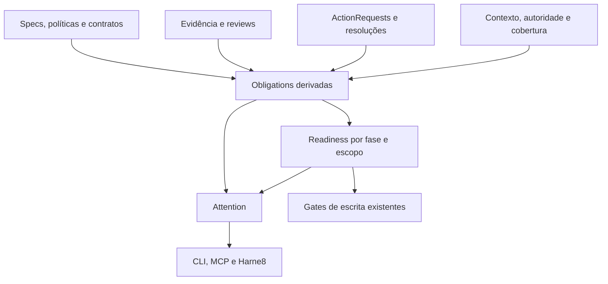

# POSE — terceira análise consolidada e base final de backlog

**Data:** 3 de outubro de 2026.  
**Repositório:** oseiaspereira88/pose.  
**Baseline auditada:** 392aaa5a007f745cdf1804f65631ea2792567fd9.  
**Escopo:** consolidação crítica das duas análises fornecidas, com verificação dirigida do estado do motor, das políticas, dos testes e dos registros do próprio projeto.  
**Situação deste documento:** diagnóstico e proposta; os itens do backlog ainda não foram implementados nem criados como issues ou specs no repositório.

## 1. Parecer executivo

O POSE atual possui uma base consistente de governança de entrega: rastreabilidade de requisitos, evidência vinculada ao escopo, bundles selados, julgamento explícito, observação estrutural e preservação de histórico. A direção Anti-Bad-Mechanization está correta. O próximo avanço deve concentrar-se em **precisão das afirmações, coerência das pendências e redução do trabalho operacional exigido para governar uma entrega**.

As análises anteriores identificaram bem o problema de ações pendentes do usuário. A consolidação refinada é:

> O motor precisa representar, de forma consultável e causal, o que ainda é devido, qual fonte estabelece essa obrigação, quem tem autoridade para resolvê-la, qual fase ela impede e o que continua possível enquanto ela permanece aberta.

A solução recomendada combina duas peças com responsabilidades distintas:

- **Obligation:** projeção normalizada das obrigações existentes. Não cria um segundo ledger de estados que já podem ser derivados.
- **ActionRequest:** registro persistente de uma solicitação material a um ator, quando esse fato ainda não existe em outra fonte autoritativa.

Uma terceira peça, **Readiness por fase e escopo**, interpreta essas informações. A experiência de uso aparece em **Attention**, preferencialmente sobre as superfícies de estado já existentes.

A correção da semântica de autoria e confirmação das reviews é igualmente prioritária. Registrar uma identidade humana não comprova que a pessoa produziu, examinou ou confirmou a conclusão. Acrescentar campos ao JSON também não comprova isso: é necessário distinguir declaração, confirmação observada e afirmação autenticada por uma autoridade.

Para buscar excelência, há trabalho anterior à expansão arquitetural: corrigir inconsistências concretas, reconciliar pendências antigas e tornar visível a governança efetivamente aplicada. Um backlog que misture capacidades já implementadas, adoção ainda pendente, aceitação externa e novas funcionalidades produzirá retrabalho.

## 2. Método, evidências e limites

Foram lidos integralmente os dois textos fornecidos. A primeira análise propõe Governed Actions e uma evolução explicativa do readiness. A segunda identifica a fragmentação mais ampla das pendências e propõe uma projeção comum antes de novos artefatos persistentes.

A verificação adicional examinou:

- o HEAD de main e os releases recentes;
- código de readiness, start, review, authority, contract adoption, design basis, causality closeout, state, spec transfer, métricas, amendments e public claims;
- testes pertinentes, sem executá-los nesta auditoria;
- políticas efetivas do repositório;
- o relatório do ciclo autônomo, o manifesto preparado da 6.3.0, o registro de medição do quickstart e a spec de compactação;
- as 12 specs não terminais listadas no índice, consultando seus arquivos fonte individualmente;
- templates e instruções operacionais de feature e closeout.

A análise distingue três níveis:

| Nível | Significado |
|---|---|
| Fato observado | Consta do código, da política ou de um registro consultado |
| Interpretação arquitetural | Consequência ou risco inferido desses fatos |
| Proposta | Comportamento recomendado para uma próxima versão |

Os resultados de validação mencionados nos registros pertencem às execuções anteriores documentadas pelo projeto. Esta auditoria **não executou novamente a suíte, os benchmarks ou o fluxo completo**. Também não verificou cada um dos 123 follow-ups históricos nem o estado atual do repositório Harne8. Isso impede declarar o inventário operacional inteiro reconciliado ou garantir eficácia em campo.

Os códigos E01–E32 identificam fontes primárias no apêndice. As referências ao código usam o commit auditado, para preservar a reprodutibilidade do parecer.

## 3. Correções às análises anteriores

### 3.1. Versão preparada e versão publicada precisam aparecer separadamente

O HEAD continua no commit usado nas análises anteriores. Entretanto, o relatório registra que a 6.3.0 foi preparada e ainda não havia tag. A consulta aos releases publicados retorna a 6.2.0 como mais recente. O manifesto da 6.3.0 possui prepared_at e os insumos congelados. [E01, E02, E03]

Logo, os achados descrevem **o candidato 6.3.0 presente na main**, não uma publicação já comprovada da 6.3.0.

Esse detalhe tem implicação interna: public-claims usa o valor engine_version de uma fonte local e expõe released_version. O arquivo declarado é compatibility.json. A nomenclatura atribui ao dado local uma evidência de publicação que ele não contém. O próprio código explica que o gate precisa funcionar antes de a release existir. [E27, E28]

A correção preserva a validação offline de consistência do candidato, mas distingue candidate_version, prepared_version e published_version. A publicação pode ser comprovada por evidência retida do processo de release; não exige consultar a rede em todo gate.

### 3.2. Capacidade existente não equivale a capacidade adotada

A política do repositório não ativa atomic_start_version, contract_nodes_version ou causality_closeout_version. O código trata a ausência como não adoção dessas capacidades. As specs documentam explicitamente implementação sem rollout e dependência de piloto e stop/go. [E04, E09, E10, E19]

Portanto, a formulação “o lifecycle já ganhou início atômico” precisa de uma condição: **o motor oferece esse comportamento; sua aplicação exige adoção**.

A política também não configura identity_assurance: verified. A ausência resolve para declared. A política de DoR possui adopted_at vazio. Isso não elimina outras validações ou o gate de entrada: significa que esse cutoff específico de readiness não está adotado. [E04, E05, E08]

### 3.3. Algumas datas declaradas na política não são consumidas

Há uma inconsistência verificável no caminho de compatibilidade:

1. A política contém explicit_judgment_adopted_at e structural_causality_adopted_at.
2. O registry relaciona esses nomes aos contratos.
3. ReviewPolicy não possui esses dois campos.
4. ContractAdoptedAt consulta o mapa e, no fallback legado, trata somente os três contratos anteriores.
5. O registro do quickstart mostra doctor diagnosticando esses campos como não lidos. [E04, E08, E18]

A conclusão correta é **cutoff legado ignorado**, com risco para a interpretação do histórico. Não é correto concluir que explicit judgment e structural causality estejam desligados: bundles novos selam os contratos do registry, e bundles já carimbados são julgados pelo que selaram. [E08, E30]

O ajuste deve preservar a precedência do mapa contract_adoptions, a distinção entre ausência e vazio explícito e a leitura de bundles históricos. Esta é uma correção concreta que merece preceder uma nova camada de abstração.

### 3.4. Blocked distorce resolução, mas não é contado como sucesso no numerador

A skill descreve blocked como terminal; readiness o trata como impedimento especial e mantém done, superseded e abandoned como terminais. Adoption metrics inclui blocked no denominador de “specs resolvidas”. [E06, E13, E14]

A segunda análise acerta a inconsistência, mas a interpretação precisa de precisão: **blocked reduz a razão de sucesso como desfecho resolvido; não incrementa o numerador de sucesso**.

Trocar o denominador altera o significado de uma métrica pública. A correção requer versionamento ou uma nova dimensão, não uma mudança silenciosa apresentada como patch invisível.

### 3.5. Compactação comprovou economia de armazenamento

A spec registra redução de 10.944.610 para 4.625.216 bytes, mantendo os elementos de integridade comparados. Isso representa aproximadamente 57,7% menos bytes. As medianas registradas de pose index foram 46,85 s e 48,01 s em cinco execuções. [E20]

A medição apoia redução de volume e ruído de diffs. Não demonstra aceleração do indexador. O próprio registro aponta aumento de 2,5% e não o apresenta como speedup.

### 3.6. A medição automatizada não encerra a aceitação humana do quickstart

O registro de 6,964 s mede instalação e execução automatizada do loop, excluindo preparação da imagem, leitura e desenvolvimento humano. A spec original pede uma medição seguindo o texto publicado, em ambiente limpo, e tem uma intenção de experiência de primeiro uso. [E18, E23]

É preciso decidir se a aceitação original continua exigindo observação de uma pessoa ou se seu escopo será formalmente alterado. A medição existente pode satisfazer parte do trabalho; não pode ser reinterpretada como tempo de aprendizado de um usuário.

## 4. O que deve ser preservado

### 4.1. Separação entre observação e julgamento

O Design Basis estrutura premissas e decisões; a observação estrutural mantém limites e unknown explícito. O ADR rejeita converter estrutura em uma nota automática de arquitetura. [E11, E21]

Isso deve continuar sendo uma invariante: o motor verifica relações e fatos observáveis; a adequação da solução exige julgamento. Proporcionalidade não deve virar um limite universal de linhas, arquivos ou abstrações.

### 4.2. Evidência vinculada ao assunto revisado

Bundles, digests, classes de evidência e provenance reduzem a possibilidade de tratar qualquer teste aprovado como prova de qualquer entrega. A separação entre critério mecânico e critério de julgamento melhora a honestidade de auto-attest. [E07, E08]

A capacidade tem valor, mas não prova que todo requisito foi testado suficientemente. Presença de referência e adequação da evidência são dimensões diferentes.

### 4.3. Histórico e aprovação em contexto

O motor preserva tentativas, supersessions e contratos selados. Há testes que distinguem bundle sem carimbo, contrato ausente do carimbo e contrato efetivamente governante. [E30]

Uma migração deve preservar essas diferenças. Reinterpretar todo o histórico com regras novas criaria governança retroativa e retrabalho sem benefício demonstrado.

### 4.4. Dependência separada de prioridade

depends_on representa pré-requisito; prioridade representa preferência. Essa distinção deve permanecer. Uma demanda importante não vira automaticamente pré-condição causal de outra entrega.

### 4.5. Fronteira com Harne8

POSE representa intenção, autoridade, pendência, evidência e elegibilidade governada. Harne8 pode coordenar workers, leases, filas, retries e capacidade. ActionRequest não precisa carregar um scheduler distribuído.

Essa fronteira permite que o POSE continue útil sozinho, com contratos que um control plane possa consumir.

## 5. Diagnóstico consolidado por dimensão

| Dimensão | Avaliação baseada nas fontes | Lacuna principal |
|---|---|---|
| Integridade de evidência | Base forte de vinculação e verificação | Reuso e preparação ainda exigem cuidado operacional |
| Rastreabilidade de requisitos | Modelo estruturado e verificável | Referenciar evidência não garante adequação sem julgamento |
| Causalidade do design | Boa fundação de R/A/D e observação | Adoção parcial; validade de premissas no tempo |
| Review soundness | Separação útil entre mecânico e julgamento | Autoria, confirmação e conteúdo intelectual pouco discriminados |
| Review authority | Caminho declarado e caminho verificado distintos | UX pode atribuir ao modo declarado garantias excessivas |
| Ações humanas ou externas | Há representações parciais em outros subsistemas | Falta solicitação persistente e consultável com efeito causal |
| Pendências | Vários modelos locais úteis | Falta projeção comum, cobertura e referências estáveis |
| Readiness | Bom para elegibilidade global por dependência | Frases e booleanos insuficientes para fase e escopo |
| Lifecycle | Simples e útil | Semântica conflitante de blocked |
| Follow-ups | Dispositions, owner e revisão permitem governança | Reconciliação incompleta; open não é trabalho novo automaticamente |
| Estado e continuidade | Artefato agregado já existe | Freshness e snapshot precisam acompanhar respostas operacionais |
| Governança efetiva | Registry e capacidades oferecem base | Adoção, cutoff, policy e enforcement dispersos |
| Eficiência computacional | Há otimizações e medições reais | Não há evidência suficiente para quantificar ganho global |
| Eficiência de interação | Primitives permitem controle detalhado | Closeout expõe ao operador a ordem causal dos passos |
| Governança adaptativa | Progressive review tem direção adequada | Assessment e templates ainda contêm obrigações universais |
| Eficácia contra mecanização | Melhora estrutural substancial | Rituais podem cumprir o formato sem cumprir o propósito |

As avaliações não constituem benchmark de maturidade ou certificação de produção.

## 6. Achados prioritários

### F01 — Atribuição de review pode sugerir intervenção humana inexistente

**Evidência:** o relatório do ciclo registra 16 attestations para oito specs, oito substituídas por invalidação. Elas usam human:oseias, embora o agente tenha redigido e aplicado as conclusões. O modelo da attestation possui reviewer, authority e decisão, mas não discrimina claramente preparação, conclusão, aplicação e confirmação. [E01, E07]

**Risco:** alguém consumir o registro como revisão humana independente. Uma identidade declarada pode ser tecnicamente válida e produzir uma interpretação excessiva.

**Correção:** atribuir papéis de forma explícita; mostrar o nível de garantia; vincular confirmações ao conteúdo exato. Registros antigos permanecem intactos e aparecem como atribuição legada não discriminada. Um suplemento posterior pode esclarecer o histórico sem alterar a attestation original.

### F02 — Garantia de separação depende do modo de identidade

No caminho declared, as verificações relevantes usam a identidade textual e seus prefixos. No caminho verified, há claim assinado, principal, execuções, issuer, audience e grants. A própria documentação do código explicita os limites de ambos. [E07, E08, E16]

**Risco:** apresentar “same-actor-separate-execution” ou “different-actor” como separação autenticada quando o modo ativo somente aceita declarações.

**Correção:** distinguir separação requerida, separação declarada e separação verificada. Mesmo uma separação verificada não prova independência cognitiva. Evitar exigir identidade verificada em toda mudança; o requisito deve seguir a autoridade e o risco do escopo.

### F03 — Adoção e compatibilidade possuem uma lacuna concreta

As datas legadas dos dois contratos novos não chegam ao leitor tipado nem ao fallback de ContractAdoptedAt. [E04, E08, E18]

**Risco:** política parecer configurada sem que o cutoff produza o efeito esperado. Uma correção ingênua também pode reclassificar o histórico de forma inesperada.

**Correção:** testar a matriz mapa/legado/ausência/vazio/conflito para todos os contratos registrados, preservando a autoridade do bundle selado.

### F04 — Public claims confunde consistência do candidato com publicação

**Evidência:** a fonte é metadado local; o resultado se chama released_version; o manifesto auditado está preparado e o release público mais recente é 6.2.0. [E02, E03, E27, E28]

**Correção:** distinguir a consistência do candidato da publicação comprovada e ajustar os rótulos e contratos de saída com compatibilidade explícita.

### F05 — Pendências têm representações fragmentadas

Readiness possui WaitingOn; review possui ReviewAttestationPendency; closeout possui Blockers e NextAction; start possui Obligations e Reconciliation; state possui RefreshPending; docs possui ReviewPending; spec transfer possui OpenObligations. [E06–E10, E15, E17, E29]

**Risco:** o agente precisar reconstruir estado causal a partir de múltiplas chamadas e textos. Uma informação pode desaparecer de uma superfície sem uma resolução rastreável em outra.

**Correção:** um read model comum com adapters. Não substituir todas as fontes nem transformar todo evento local em um artefato novo.

### F06 — Falta uma entidade para solicitações materiais ao ator

A necessidade de escolher uma alternativa, aceitar um risco, fornecer uma informação ou realizar uma operação externa não equivale a um follow-up nem a uma dependência de spec concluída.

**Correção:** ActionRequest persistente com destinatário, autoridade necessária, conteúdo da solicitação, escopo afetado, efeito por fase e resolução vinculada. Perguntas comuns sem consequência governada continuam sendo interação normal.

### F07 — Blocked mistura situação operacional e desfecho

Além da divergência entre manual, runtime e métricas, spec transfer usa blocked durante staging e quando requer evidência nova. Removê-lo sem examinar esse uso quebraria uma proteção do fluxo de transferência. [E06, E13, E14, E15]

**Correção:** alinhar a semântica agora, conservar leitura legada e migrar o uso técnico em transfer antes de uma remoção breaking.

Não converter automaticamente uma spec legada blocked em in-progress: ela pode nunca ter sido iniciada. Quando não houver registro suficiente, preservar o status bruto e indicar fase anterior desconhecida.

### F08 — Readiness global não expressa a fronteira do bloqueio

Um critério pendente de closeout pode permitir implementação; uma decisão de produto pode impedir somente um requisito; uma aceitação de publicação pode impedir só a release.

**Correção:** representar fases e escopos separadamente. Não inferir independência entre requisitos a partir da simples ausência de relação explícita.

### F09 — Closeout expõe causalidade interna ao operador

A skill exige regenerar a evidência em results_path, indexar, selar, preparar critérios mecânicos, responder julgamentos, verificar e fechar em uma ordem específica. Ela documenta um caso em que bundles selaram evidência antiga porque o arquivo esperado não era atualizado. [E13]

**Risco:** sequenciamento incorreto gerar attestations inválidas, repetição de comandos e perda de confiança nos gates.

**Correção:** evoluir o mecanismo de closeout existente para preparar e retomar um plano verificável. O executor automatiza os passos mecânicos; pendências de julgamento permanecem explícitas.

Não prometer uma transação ACID envolvendo Git, processos e serviços externos. O contrato deve ser de operação recuperável, com checkpoints e reaplicação idempotente.

### F10 — Inventário de pendências e realidade de implementação divergem

O relatório inicial cita 13 specs não terminais e 123 follow-ups, com aviso explícito de que a contagem não representa o backlog de implementação. O índice consultado lista 291 specs, das quais 12 não terminais; os 12 arquivos consultados mantêm esses estados. O project-state retido ainda resume 283 specs. [E01, E22, E31]

**Correção:** reconciliação por requisito e evidência atual, com identificação do snapshot. Os números de snapshots distintos não são diretamente comparáveis como medição de produtividade.

A leitura das 12 fontes confirma os seus estados, não a validade de cada trace nem a inexistência de trabalho não indexado.

### F11 — A superfície padrão ainda contém trabalho ritual

O template repete intenção, plano, tarefas, validação, resumo e relatório final. As instruções de feature mandam executar discovery antes e depois da mudança. [E12, E24]

**Correção:** reaproveitar observações válidas e mostrar uma superfície progressiva. Preservar escrita humana ou agentic para intenção, decisões materiais e disposições; gerar conteúdos factuais quando a fonte e o escopo permitirem.

Um assessment recente não pode ser reutilizado somente por idade. Deve ser válido para o componente, o commit ou conteúdo relevante, a versão da ferramenta e os contratos observados.

### F12 — Métricas ainda não explicam bem espera e retrabalho

Governance outcomes mantém duration, cost, attempts e unknown. O código informa que a telemetria atual não tem campo de espera e incrementa WaitDurationUnknown. [E17]

**Correção:** observar intervalos de espera e motivos de invalidação. Não converter o tempo total da spec em tempo ativo, nem assumir que um blocker aberto impediu todo trabalho.

## 7. Arquitetura recomendada

### 7.1. Fontes continuam autoritativas

| Informação | Fonte autoritativa | Projeção |
|---|---|---|
| Pré-requisito de spec | depends_on e resolver de artefatos | Obligation de dependency |
| Critério exigido | Plano e contratos selados aplicáveis | Obligation de review/judgment |
| Evidência exigida e ausente | Gate produtor e evidência do escopo | Obligation de evidence |
| Falha de atualização | Estado do subsistema produtor | Obligation de reconciliation |
| Finding aberto | Finding e sua disposition | Obligation de remediation |
| Condição de publicação | Lifecycle e evidência de release | Obligation de release |
| Solicitação material nova | ActionRequest e seus eventos | Obligation de actor action |
| Dívida residual | Follow-up original | Attention de backlog; efeito não bloqueante por padrão |

Uma obrigação derivável não recebe outro campo mutável de “resolvida” no agregador. Resolver sua fonte faz a projeção mudar.

### 7.2. Desenho dos contratos



Este desenho é uma recomendação. Não descreve uma implementação já existente.

### 7.3. Obligation como read model

O contrato mínimo deve separar:

- **identidade:** ID estável, project ID e referência da fonte;
- **dever:** categoria, razão com código, condição de satisfação e regra que o exige;
- **destinatário:** ator conhecido, papel exigido ou ausência de responsável;
- **alcance:** refs de spec, requisito, decisão, surface ou release;
- **efeito:** quais fases e quais escopos a obrigação restringe;
- **observação:** revisão da fonte, freshness, cobertura e limitações;
- **satisfação:** pending, satisfied, waived, cancelled ou invalidated conforme o domínio produtor.

Não se recomenda um enum único que misture unknown, waiting e blocked. Eles respondem perguntas diferentes:

| Conceito | Pergunta |
|---|---|
| Satisfação | A condição exigida foi atendida? |
| Conhecimento | O motor dispõe de dados atuais suficientes para responder? |
| Espera | A condição depende de algo fora da execução disponível? |
| Bloqueio | A condição não satisfeita impede esta fase deste escopo? |

Uma fonte não lida, inválida ou stale não pode virar ausência de obrigação. A resposta deve carregar cobertura incompleta e indicar a limitação pertinente.

Os IDs derivados devem depender da identidade lógica da fonte, não de texto de diagnóstico, ordem de lista ou horário da consulta. A revisão da fonte acompanha o ID sem transformar cada renderização em uma obrigação nova.

### 7.4. Referências devem ser qualificadas

R4 e D2 são locais a uma spec. Não devem ser utilizados como IDs globais.

Exemplo conceitual:

```yaml
node:
  artifact: xref:proj.pose-dist/spec:storage-refactor
  kind: requirement
  id: R4
```

A representação exata pode aproveitar os contratos atuais de referências qualificadas. O ponto essencial é preservar projeto, autoridade canônica e namespace do nó.

Acrescentar action: à gramática de depends_on deve ser uma evolução explicitamente adotada, se for necessária. A primeira entrega pode vincular a ação a um escopo sem ampliar o significado de depends_on.

### 7.5. Snapshot e cobertura fazem parte da resposta

Uma consulta central precisa mostrar de que estado ela fala:

```yaml
snapshot:
  project: proj.pose-dist
  authority_context: "<context_revision>"
  source_revision: "<commit ou digest do working tree>"
  policy_digest: "<digest>"
  generated_at: "<timestamp>"
  coverage:
    readiness: current
    review: current
    release: unavailable
```

São campos conceituais, não uma nova política paralela. A implementação deve reusar os digests e o contexto já existentes.

A consulta não deve disparar efeitos externos nem refresh caro silencioso. Pode oferecer um próximo passo mecânico explícito quando a fonte exigir atualização.

### 7.6. Typed diagnostics devem nascer nos produtores

Normalizar Blockers []string por regex criaria outra dependência de interpretação textual. O caminho correto é acrescentar códigos e refs estruturadas nos subsistemas produtores, preservando as mensagens humanas antigas durante a transição.

Um adapter legado pode expor um blocker opaco com sua fonte e cobertura limitada. Ele não pode inventar ator, requisito afetado ou condição de desbloqueio a partir de uma frase ambígua.

## 8. ActionRequest e o ciclo de agência

### 8.1. Quando criar uma solicitação

Uma solicitação persistente é adequada quando a resposta ou operação altera materialmente escopo, autoridade, aceitação de risco, execução, closeout ou publicação e não pode ser derivada de outro artefato existente.

Antes de criar, o agente deve considerar as instruções e autorizações já dadas. Uma ação que o usuário já autorizou não deve produzir outra pergunta só para preencher o modelo. Também não deve ser registrado um histórico de autorização que o motor não observou.

Exemplos adequados:

- escolher manter ou romper uma compatibilidade pública;
- aceitar um risco residual que a política permite aceitar;
- confirmar uma publicação de um candidato definido;
- fornecer um dado externo indispensável;
- realizar uma operação em um serviço que o agente não controla.

Preferências cosméticas reversíveis, dúvidas locais de implementação e questões que o agente pode resolver dentro do escopo autorizado não viram ActionRequest automaticamente.

### 8.2. Contrato conceitual

```yaml
id: "<id estável e único>"
schema_version: 1
origin: xref:proj.pose-dist/spec:storage-refactor

requested_by:
  principal: agent:implementation
  execution: run-17

recipient:
  role: maintainer

kind: decision
question: "A próxima entrega preservará compatibilidade com o schema v1?"
options:
  - id: preserve-v1
    consequence: "Manter leitura do formato anterior."
  - id: break-v1
    consequence: "Exigir migração de consumidores."

targets:
  - artifact: xref:proj.pose-dist/spec:storage-refactor
    kind: requirement
    id: R4

effects:
  execution: block-targets
  closeout: block-scope

requested_at: "<timestamp>"
request_digest: "<digest do conteúdo solicitado>"
```

Não há um armazenamento de credenciais no objeto. Uma operação de provisionamento de acesso registra a necessidade e o resultado por referência apropriada.

A solicitação contém informação suficiente para a pessoa decidir: contexto, alternativas, consequências, recomendação quando existir e o que fica parado. Ela não é uma notificação vaga de “aprovação necessária”.

### 8.3. Estados e eventos

Uma solicitação pode ser aberta, respondida, cancelada, substituída ou invalidada. Sua satisfação governada é calculada pela resposta e pela regra que a exigiu.

**Respondida não significa satisfeita.** Se uma aprovação é recusada, houve resposta, mas a autorização não foi obtida. Cancelar a pergunta não remove a exigência original. Uma dispensa exige autoridade e uma disposition permitida pelo contrato aplicável.

A resolução deve registrar ator, execução ou canal observado, resposta, timestamp, request digest, escopo e evidência de autoridade no nível exigido. Correções posteriores usam eventos de supersession ou amendment.

### 8.4. Autoria, julgamento, confirmação e aplicação

| Papel | O que representa | O que não comprova sozinho |
|---|---|---|
| prepared_by | Quem preparou o rascunho | Quem concordou com ele |
| concluded_by | Quem emitiu a conclusão registrada | Independência cognitiva |
| confirmed_by | Quem confirmou conteúdo ou operação delimitada | Autoria do rascunho |
| applied_by | Quem gravou ou executou o registro | Quem exerceu julgamento |
| authority evidence | Por que o principal pode tomar essa decisão | Verdade material de toda afirmação do emissor |

Esses papéis podem coincidir. Não é necessário obrigar quatro campos completos em todo caso simples. O dado ausente deve continuar ausente ou unknown, sem ser copiado de reviewer por conveniência.

Uma confirmação de rascunho deve especificar se adotou as conclusões ou somente autorizou uma operação. Uma autorização genérica para executar o ciclo não deve ser promovida a confirmação de review independente.

### 8.5. Limite de confiança

No modo declarado, o motor registra afirmações e deve rotulá-las assim. No modo verificado, valida uma afirmação autenticada de um emissor autorizado, vinculada ao assunto. O motor não prova que o emissor falou a verdade nem que a pessoa compreendeu cada detalhe.

Para uma boundary que exige humano, o caminho de confirmação deve produzir evidência que o agente não possa fabricar apenas definindo confirmed_by: human:oseias. Um mecanismo confiável de interação ou emissor pode fornecer essa evidência; o core valida seu contrato. O funcionamento local continua possível no modo declarado, com sua limitação explícita.

### 8.6. Mudança do assunto e concorrência

Uma confirmação deve ser vinculada ao conteúdo relevante. Se a pergunta, as alternativas, a revisão ou o candidato aprovado mudarem materialmente, a confirmação anterior deixa de satisfazer o novo pedido.

Duas resoluções concorrentes usam a revisão esperada e uma operação idempotente. Uma repetição idêntica não cria duas respostas. Respostas conflitantes preservam história e exigem resolução explícita; não ganham pela última gravação silenciosa.

O binding inclui projeto e contexto de autoridade. Uma resposta válida em um projeto não deve resolver automaticamente uma solicitação homônima em outro. Transferência de spec deve remapear ou invalidar solicitações conforme seu contexto, preservando provenance.

## 9. Readiness e Attention

### 9.1. Readiness por fase

Fases iniciais suficientes:

| Fase | Pergunta |
|---|---|
| Start | Pode iniciar este escopo sob o contrato atual? |
| Execution | Pode executar esta parte do trabalho? |
| Review | O assunto está preparado para a review exigida? |
| Closeout | A entrega pode ser encerrada? |
| Release | A publicação está autorizada e pronta? |

O valor Ready bool legado permanece com o seu significado anterior durante a migração. Um novo campo operacional não deve converter ready=false em ready=true apenas porque uma parte da spec pode avançar.

Uma mudança da semântica do campo exige novo contrato. É melhor acrescentar a projeção do que induzir consumidores antigos a tratar elegibilidade parcial como autorização global.

### 9.2. Trabalho parcialmente possível

O motor pode identificar escopos explicitamente fora da fronteira de uma obrigação. Isso não basta para provar que são independentes: uma decisão de arquitetura pode alterar toda a implementação, apesar de estar descrita perto de R4.

A primeira versão deve preferir formulações conservadoras:

- bloqueio conhecido sobre R4;
- nenhuma restrição direta encontrada sobre R1 no conjunto de fontes consultado;
- independência não demonstrada;
- recomendação do planner sujeita à intenção e às dependências conhecidas.

Apenas quando as relações pertinentes forem explícitas e a cobertura suficiente deve aparecer “executável sob estas condições”. Não é necessário um DAG obrigatório de todos os requisitos.

### 9.3. Interface humana

Preferir uma evolução de pose state e pose_project_state. Uma opção como state --attention é proposta de UX, não um comando disponível hoje.

A resposta humana deve apresentar primeiro:

1. ações que exigem aquele usuário ou papel;
2. o efeito atual de cada pendência;
3. o que pode continuar;
4. pendências de closeout e release;
5. limitações de freshness ou cobertura.

Ordenação não é causalidade. Uma pendência de baixa urgência que impede release continua sendo blocker dessa fase, mesmo aparecendo depois de um item urgente.

Agrupar solicitações relacionadas pode reduzir interrupções. O agrupamento não funde IDs, autoridade ou respostas que têm escopos diferentes.

### 9.4. Interface para agentes

Uma consulta estruturada de obligations, com filtros por scope, actor, kind, phase e state, evita criar ferramentas separadas para cada subtipo de espera.

Mutação fica nas ferramentas de ActionRequest e nos subsistemas autoritativos. Não criar resolve_obligation genérico para uma projeção derivada.

O agente recebe refs, reason codes, condições de satisfação e próximos passos possíveis. A mensagem humana é uma renderização dessas informações, não o contrato que outro agente precisa reinterpretar.

### 9.5. Enforcement por toda superfície de escrita

Attention não é um gate. Uma solicitação exibida na UI sem ser considerada no closeout ou no release apenas desloca o problema.

Quando a capability for adotada, os gates pertinentes devem consultar as condições necessárias nos pontos de escrita de Store, CLI e MCP. Consumidores de alto nível não podem ser a única proteção. Read-only e preview continuam sem efeitos.

## 10. Eficiência e governança proporcional

### 10.1. Medir custos diferentes

| Custo | Medida pertinente | Cuidado |
|---|---|---|
| Computação | Tempo, CPU, memória e bytes por operação | Mesmo corpus, ambiente e entradas |
| Interação | Perguntas, toques humanos e comandos por entrega | Relacionar à materialidade da mudança |
| Retrabalho | Attestations substituídas, revalidações e invalidations | Distinguir descoberta válida de defeito operacional |
| Espera | Intervalos por causa e escopo | Deduplicar intervalos simultâneos |
| Contexto | Fontes lidas, tamanho de payload e refreshes | Não tratar menos contexto como sempre melhor |
| Manutenção | Estado persistido, adapters e versões suportadas | Observar custo de compatibilidade |

A abertura de uma obrigação às 10h e a resolução às 16h medem seis horas de pendência. Isso não comprova seis horas de paralisação do agente. A telemetria deve identificar se o intervalo representa idade, espera atribuída ou bloqueio total conhecido.

Unknown permanece unknown. False blocker é uma classificação de diagnóstico ou adjudicação; o motor não deve inferir falsidade porque alguém dispensou um gate.

Um fator genérico “governança/trabalho de entrega” tem unidades e limites frágeis. É preferível apresentar dimensões observadas separadamente, sem um score de eficiência.

### 10.2. Reuso limitado e rastreável

A expressão da segunda análise “reusar evidência sem reusar julgamento” é útil como alerta, mas rígida demais como contrato universal. O POSE já possui criterion reuse.

A regra consolidada é: **reusar somente quando os inputs materiais da observação ou do critério continuam equivalentes e a política permite**.

Isso envolve escopo, conteúdo relevante, classes, ferramenta, ambiente, profile e autoridade quando aplicáveis. Um judgment não deve ser copiado para assunto diferente; também não precisa ser repetido porque um relatório derivado foi reformatado sem alterar o assunto que fundamentou a conclusão.

### 10.3. Superfície progressiva de spec

Conteúdo autoritativo: intenção, requisitos, constraints, non-goals, premissas e decisões materiais, delivery intent e dispositions.

Conteúdo derivável: arquivos observados, resultados de comandos, referências coletadas e partes factuais dos resumos.

Conteúdo operacional local: decomposição de Tasks. Ela pode ajudar o planner, sem constituir um scheduler do motor.

A interface deve apresentar o necessário para a fase e materialidade. A versão resumida não pode esconder unknown, omitir obrigação adotada ou eliminar uma rationale que exige julgamento.

### 10.4. Closeout recuperável

A evolução recomendada deve produzir um plano:

- verificar contexto e gates adotados;
- preparar evidência necessária no destino correto;
- regenerar apenas o que ficou stale;
- indexar e selar os insumos;
- preparar critérios mecânicos;
- expor julgamentos e autorizações pendentes;
- verificar as condições novamente antes da transição;
- aplicar e registrar o closeout;
- retomar de checkpoint após interrupção.

O plano não autoaprova judgment, não publica release por ter fechado uma spec e não altera silenciosamente a política para conseguir concluir.

## 11. Resistência à mecanização do próprio POSE

Para cada novo gate, o design deve examinar um exemplo de cumprimento formal que não produz seu valor pretendido.

| Mecanismo | Forma barata de satisfazer o formato | Resposta proporcional |
|---|---|---|
| Human review | Agente escreve tudo e usa nome humano | Atribuição e confirmação vinculada, com assurance explícita |
| Reviewer separado | Segunda sessão copia a primeira | Separação observada sem alegar independência cognitiva |
| Minimal option | “Não fazer nada” em todas as decisões | Julgamento sobre suficiência e trade-offs concretos |
| Falsifier | Condição impossível de ocorrer | Revisão quando a condição for material e observável |
| Requirement trace | Mesma referência genérica em todos os R | Scope e classe verificáveis; adequação julgada |
| ActionRequest | Toda dúvida vira blocker | Materialidade, autoridade e autorização existente |
| Follow-up | Despejar qualquer residual em open | Reconciliação e disposition com owner real |
| Attention vazio | Fonte com erro é omitida | Coverage e unknown explícitos |
| Metrics | Minimizar número de reviews | Dimensões separadas por contexto |
| Closeout automático | preencher conclusões para terminar | Passos mecânicos automáticos, judgment pendente |

Essa análise pode integrar a review de mudanças de governança; não precisa gerar um artefato adicional em toda feature do produto.

A pergunta de design central é: o mecanismo previne um modo de falha material e faz isso com a menor carga necessária?

## 12. Reconciliação do backlog já existente

Esta tabela é uma triagem das 12 specs não terminais verificadas, não uma disposition aplicada. Deve anteceder a criação de specs que repetiriam seus objetivos.

| Spec | Estado da fonte | Trabalho restante a verificar | Tratamento recomendado |
|---|---|---|---|
| pose-release-security-gate-integrity | in-progress | Trace, evidência atual, review e fechamento; o ciclo registra novas correções de segurança/CI | Reconciliar requisitos antes de implementar novamente |
| pose-release-recovery-verification | in-progress | Aceitação real de publicação e instalação; já existem releases posteriores e medição retida | Confrontar R1–R5 com evidência publicada; manter somente gaps reais |
| pose-cli-output-rendering-system | in-progress | R2/R8/R12, superfície machine, localisation e cobertura; houve entregas posteriores de renderer | Mapear sucessoras e evidência atual; preservar residual genuíno |
| pose-canonical-positioning | in-progress | Implementação e Tasks indicadas como concluídas; revisão do trace e closeout | Candidato a fechamento governado, não nova feature |
| pose-readme-evaluation-path | in-progress | Tasks indicadas como concluídas; revisão final e dependências | Candidato a reconciliação e closeout |
| pose-first-governed-loop-quickstart | in-progress | Aceitação R4 e validade atual do percurso publicado | Usar medição automatizada com seu alcance; adjudicar observação humana |
| pose-launch-proof-demo | in-progress | Registro existente versus antigo gap R4; embedding R5 no Harne8 | Reconciliar gravação; verificar integração no repositório competente |
| pose-sdd-migration-acquisition | in-progress | Integração de R5 na landing; fonte ainda descreve metade pendente | Conferir Harne8; não reescrever importers por causa de status aberto |
| pose-community-contribution-surfaces | in-progress | Issues e Discussions reais R2–R4 | Operações externas deliberadas; a análise não as publica |
| pose-docs-canonical-route | in-progress | Redirect preservando path R3 | Manter decisão de adiamento; não inferir autorização para mudar host |
| pose-agy-smoke-test | draft | Execução real via AGY e Harne8 Desktop | Aceitação externa ao core; não simular agente criando o arquivo manualmente |
| pose-package-channels-deferred-native-verification | draft | Rodada macOS/Windows e canais nativos | Preservar adiamento explícito; não tratá-lo como defeito do motor |

As fontes correspondentes são E22, E23, E25, E26 e E32. As pendências de adoção dos contratos ABM são adicionais: estão em follow-ups de specs de implementação concluídas, não necessariamente nas 12 specs abertas. [E19]

A reconciliação dos 123 follow-ups precisa classificar cada item como:

- implementação material ainda devida;
- revisão ou aceitação de evidência já produzida;
- adoção, piloto ou rollout;
- operação externa ou humana;
- residual aceito ou adiado;
- candidato a duplicidade ou satisfação;
- intenção ausente, ambígua ou sem owner.

O sistema apresenta candidatos e evidências. Quem tem autoridade registra a disposition. Detecção lexical não fecha o item.

## 13. Decisões arquiteturais propostas

| ID | Decisão |
|---|---|
| D01 | Normalizar obrigações por projeção; persistir somente fatos e intenção que não tenham outra fonte suficiente |
| D02 | Introduzir ActionRequest como fonte própria de solicitações materiais a atores |
| D03 | Manter lifecycle pequeno; bloqueio é efeito sobre fase e escopo |
| D04 | Separar satisfação, conhecimento, espera e efeito operacional |
| D05 | Usar referências qualificadas e namespace local para R/A/D |
| D06 | Levar freshness, snapshot e coverage no contrato de consulta |
| D07 | Fazer diagnósticos estruturados nascerem nos produtores |
| D08 | Diferenciar autoria, conclusão, aplicação, confirmação e assurance |
| D09 | Preservar histórico selado; novos contratos são prospectivos e versionados |
| D10 | Evitar atestar independência cognitiva ou adequação arquitetural automaticamente |
| D11 | Evoluir state e closeout existentes, mantendo uma mesma lógica para CLI e MCP |
| D12 | Reusar evidência e critérios mediante equivalência material e política explícita |
| D13 | Aplicar novas restrições nos pontos pertinentes de escrita, sem depender só da interface |
| D14 | Manter scheduling, workers e entrega de notificações fora do core POSE |
| D15 | Medir custos e resultados separados, sem um score agregado de qualidade ou eficiência |
| D16 | Autorizações já dadas participam do contexto; não gerar confirmações repetidas para ritual |

Essas decisões devem ser reunidas em um ADR transversal ou documento de arquitetura, depois desdobradas em specs pequenas de implementação. Não se recomenda criar uma mega-spec que misture a correção de cutoff legado com scheduler, UX e observabilidade.

## 14. Sequência de entrega e compatibilidade

### Onda 0 — corrigir e reconciliar

Corrigir cutoff legado, rótulos de publicação e garantias de review; alinhar blocked; reconciliar a dívida já implementada; fechar a lacuna de amendments no layout flat.

Correções e diagnósticos compatíveis cabem no ciclo de manutenção 6.3.x. Contratos ou saídas cujo significado muda exigem versionamento e podem pertencer à próxima minor. Não encaixar mudanças incompatíveis em patch apenas por serem desejáveis.

### Onda 1 — tornar o estado consultável

Implementar a projeção de obligations somente leitura, typed diagnostics, snapshot/coverage, governança efetiva e Attention. Comparar seus resultados com os gates atuais antes de ativar qualquer restrição nova.

Uma projeção comum pode ser útil mesmo antes de ActionRequest. Isso permite testar a abstração com dados reais sem inflar o estado persistido.

### Onda 2 — atender ao caso humano e externo

Entregar um corte vertical: abrir solicitação material, consultar Attention, resolver com authority adequada, invalidar resposta stale e observar o efeito no readiness e no gate relevante.

Esse é o objetivo principal da minor 6.4 proposta. Não é necessário converter todos os subsistemas de uma vez. A v1 pode cobrir dependências de spec, judgment, closeout e ActionRequest, indicando explicitamente as fontes ainda não integradas.

### Onda 3 — reduzir fricção e medir eficácia

Evoluir closeout recuperável, reuse, assessment adaptativo, reconciliação assistida e métricas de espera/retrabalho. Piloto antes de enforcement ampliado.

### Onda 4 — evolução epistemológica e limpeza

Staleness de premissas, observação de falsifiers e revisão de decisões mediante evidência material. Mudanças de schema floor, retirada de campos legados e eventual remoção de blocked pertencem a uma major apropriada, com migração comprovada.

**A numeração de releases é uma proposta de agrupamento, não compromisso de escopo ou prazo.** A publicação preparada da 6.3.0 e qualquer autorização necessária ao seu processo permanecem sob o lifecycle já existente.

## 15. Critérios de excelência para aceitar o programa

Os testes devem observar o comportamento pretendido, inclusive recusas, recuperações e limites. Não basta validar JSON gerado pelo mesmo writer.

1. Uma review inteiramente preparada e aplicada por agente não aparece como revisão humana comprovada.
2. Identidade declarada e verificada produzem explicações distintas; separação cognitiva nunca é afirmada.
3. Toda obligation derivada aponta para uma fonte reproduzível. Consultá-la não altera a fonte.
4. Erro, unsupported ou stale em um produtor não gera “nenhuma pendência” sem limitação explícita.
5. Uma ação que bloqueia closeout permite implementação que o modelo realmente autoriza.
6. Resposta recusada, cancelamento sem autoridade e confirmação de assunto stale não liberam um gate.
7. Instrução já autorizada não é transformada em uma nova aprovação obrigatória.
8. Duas resoluções concorrentes e retries mantêm uma história coerente e não aceitam respostas conflitantes silenciosamente.
9. IDs e bindings distinguem projetos e specs com o mesmo slug ou R-ID.
10. CLI, MCP e chamadas diretas às operações de domínio aplicam a mesma regra.
11. Um transfer interrompido ou uma mudança de autoridade não deixa ações antigas desbloquearem o destino indevidamente.
12. Uma execução interrompida de closeout é retomável e não duplica attestations nem publica nada implicitamente.
13. Campos legados e mapa de adoção passam por uma matriz de compatibilidade; bundles históricos conservam o contrato selado.
14. A métrica nova de blocked não muda retroativamente o significado da série antiga.
15. O corpus de mudança trivial preserva o caminho mínimo; aumento de cerimônia exige justificativa material.
16. Falsifier observado produz reconsideração; não substitui julgamento pela invalidação automática da arquitetura.

Para o piloto, incluir mudanças triviais, mudança de contrato público, entrega multicomponente, espera humana, espera externa, recusa de aprovação, transferência de autoridade e retomada após falha.

Comparar com a baseline: comandos necessários, intervenções humanas, invalidations por causa, dados desconhecidos, tempo por operação e resultado entregue. O dogfooding do maintainer é necessário, mas não comprova sozinho ergonomia para adotantes externos.

## 16. Índice do backlog proposto

O backlog a seguir apresenta IDs estáveis, fontes, dependências e critérios de aceite. A versão JSON acompanha este documento para planejamento e processamento por agentes.

P0 identifica integridade ou correção que precisa ser resolvida antes de confiar no comportamento correspondente. P1 identifica a evolução prioritária do produto. P2 corresponde a eficiência e extensão posterior. P3 corresponde a investigação ou limpeza de longo prazo.

Severidade de achado e prioridade de entrega são dimensões distintas: um item P0 da Onda 2 não precisa anteceder todos os itens P1 da Onda 1, mas precisa anteceder o enforcement que depende dele.

| ID | Prioridade | Onda | Item |
|---|---|---|---|
| POSE-01 | P0 | 0 | Corrigir a leitura dos cutoffs legados de judgment e structural causality |
| POSE-02 | P0 | 0 | Distinguir versão candidata, preparada e publicada em public claims |
| POSE-03 | P0 | 0 | Expor garantias reais de identidade e separação de review |
| POSE-04 | P0 | 0 | Versionar a atribuição de autoria, conclusão, confirmação e aplicação de review |
| POSE-05 | P0 | 0 | Alinhar blocked entre lifecycle, transfer, readiness e métricas |
| POSE-06 | P0 | 0 | Reconciliar specs abertas e follow-ups com requisitos e evidência atual |
| POSE-07 | P1 | 0 | Dar ao layout flat de spec a mesma integridade de amendments do layout em pasta |
| POSE-08 | P1 | 1 | Projetar governança suportada, configurada, aplicável e efetiva |
| POSE-09 | P1 | 1 | Definir o contrato comum de obrigação e suas referências |
| POSE-10 | P1 | 1 | Adicionar reason codes e referências estruturadas aos produtores |
| POSE-11 | P1 | 1 | Implementar agregação de obligations somente leitura |
| POSE-12 | P0 | 1 | Garantir snapshot, freshness e cobertura nas respostas operacionais |
| POSE-13 | P1 | 1 | Expor Attention e obligations com uma lógica comum para CLI e MCP |
| POSE-14 | P1 | 2 | Persistir ActionRequest material com identidade e ciclo de vida mínimos |
| POSE-15 | P0 | 2 | Resolver solicitações com atribuição e autoridade adequadas |
| POSE-16 | P0 | 2 | Proteger resoluções contra replay, conflito, retries e mudança do assunto |
| POSE-17 | P1 | 2 | Projetar readiness por fase e escopo com continuidade conservadora |
| POSE-18 | P0 | 2 | Aplicar efeitos governados nos gates de escrita de domínio, CLI e MCP |
| POSE-19 | P0 | 2 | Preservar solicitações e obrigações durante transfer e reconciliação de autoridade |
| POSE-20 | P2 | 3 | Agrupar pedidos relacionados e apresentar perguntas concretas ao usuário |
| POSE-21 | P1 | 3 | Evoluir closeout para um plano mecânico recuperável |
| POSE-22 | P1 | 3 | Reusar evidência e critérios por equivalência material e proveniência |
| POSE-23 | P2 | 3 | Aplicar freshness e materialidade aos assessments |
| POSE-24 | P2 | 3 | Oferecer spec progressiva e gerar conteúdo factual derivável |
| POSE-25 | P2 | 3 | Sinalizar candidatos a reconciliação de follow-ups sem auto-close |
| POSE-26 | P2 | 3 | Observar idade de pendências e intervalos de espera por causa |
| POSE-27 | P2 | 3 | Explicar retrabalho de governança e medir custo computacional |
| POSE-28 | P1 | 1 | Manter corpus adversarial contra cumprimento formal sem valor |
| POSE-29 | P1 | 3 | Executar piloto do corte vertical de agência e readiness antes do enforcement amplo |
| POSE-30 | P1 | 3 | Concluir piloto e decisão de adoção das capacidades ABM já implementadas |
| POSE-31 | P3 | 4 | Representar staleness material de premissas e seus scopes |
| POSE-32 | P3 | 4 | Fechar o ciclo de falsifiers e efeitos esperados com reconsideração explícita |
| POSE-33 | P3 | 4 | Planejar limpeza de schema, campos legados e blocked numa major apropriada |

Os 33 itens são unidades de planejamento e verificação, **não 33 specs obrigatórias**. Podem ser agrupados quando compartilham fonte, contrato e critério de entrega. Um corte vertical pequeno deve preceder a expansão para todos os subsistemas.

## 17. Backlog detalhado

### POSE-01 — Corrigir a leitura dos cutoffs legados de judgment e structural causality

**Prioridade:** P0. **Onda:** 0. **Horizonte:** 6.3.x, conforme compatibilidade. **Natureza:** correction.  
**Achados:** F03. **Fontes:** E04, E08, E18, E30.  
**Depende de:** nenhum item novo; verificar contexto e fontes atuais.

A política declara duas datas que o caminho tipado e o fallback não consomem; a configuração pode sugerir uma proteção histórica inexistente.

**Entrega esperada:** Leitura coerente dos nomes legados e do mapa contract_adoptions; Matriz de compatibilidade de todos os contratos do registry; Diagnóstico que diferencia ausência, vazio explícito, mapa e legado.

**Critérios de aceite:**

1. Um arquivo com os dois nomes legados retorna as datas declaradas no fallback pertinente.
2. Quando mapa e legado coexistem, a precedência documentada do mapa prevalece, inclusive para vazio explícito.
3. Bundles carimbados conservam seus contratos e não são reavaliados por uma data editada depois.
4. Um teste percorre todas as entradas do registry e detecta chaves legadas declaradas mas não consumidas.

**Defesa contra mecanização:** Corrigir o dado efetivo; não desativar um gate para fazer o histórico passar.

**Limites de escopo:** Reescrever attestations históricas; Adotar capacidades opt-in.

### POSE-02 — Distinguir versão candidata, preparada e publicada em public claims

**Prioridade:** P0. **Onda:** 0. **Horizonte:** 6.3.x para diagnóstico; contrato novo na próxima minor. **Natureza:** correction.  
**Achados:** F04. **Fontes:** E01, E02, E03, E27, E28.  
**Depende de:** nenhum item novo; verificar contexto e fontes atuais.

O gate é offline e lê metadados locais, mas chama o resultado de released_version; publicação precisa de evidência específica.

**Entrega esperada:** Modelo de versão e estado de publicação com proveniência; Rótulos corretos no terminal; Contrato de saída versionado com tratamento do campo legado.

**Critérios de aceite:**

1. Preparar um manifesto sem publication evidence informa prepared, nunca published.
2. A consistência do candidato pode ser verificada offline antes da publicação.
3. published_version exige evidência de publicação pertinente; sua ausência aparece como desconhecida ou não comprovada.
4. Consumidores legados têm caminho documentado de transição, sem mudança silenciosa do significado de campos.

**Defesa contra mecanização:** Preservar o gate de consistência sem transformar metadado local em fato externo.

**Limites de escopo:** Consultar GitHub em todo check; Publicar a 6.3.0 como parte deste item.

### POSE-03 — Expor garantias reais de identidade e separação de review

**Prioridade:** P0. **Onda:** 0. **Horizonte:** 6.3.x para explicações compatíveis. **Natureza:** correction.  
**Achados:** F01, F02. **Fontes:** E01, E04, E07, E08, E16.  
**Depende de:** nenhum item novo; verificar contexto e fontes atuais.

O requisito de separação no plano e o nível de assurance ativo não podem ser apresentados como a mesma garantia.

**Entrega esperada:** Explicação uniforme de declared e verified; Distinção entre separação requerida, declarada e autenticada; Diagnósticos e documentação consistentes em review e closeout.

**Critérios de aceite:**

1. Uma política sem identity_assurance expõe declared explicitamente.
2. Prefixos agent: ou human: no modo declarado não aparecem como prova de pessoa ou execução separada.
3. O caminho verified expõe o claim, o binding e a autoridade efetivamente verificados.
4. Nenhuma saída promete independência cognitiva.

**Defesa contra mecanização:** Não elevar a política de toda instância para verified apenas para melhorar o rótulo.

**Limites de escopo:** Provar pensamento independente; Exigir review humana universal.

### POSE-04 — Versionar a atribuição de autoria, conclusão, confirmação e aplicação de review

**Prioridade:** P0. **Onda:** 0. **Horizonte:** Próxima minor para o contrato prospectivo. **Natureza:** evolution.  
**Achados:** F01, F02. **Fontes:** E01, E07, E16.  
**Depende de:** POSE-03.

O episódio human:oseias não é resolvido apenas com identificação do reviewer; é preciso representar a intervenção realmente registrada.

**Entrega esperada:** Contrato prospectivo de atribuição com papéis opcionais e modos de intervenção; Binding da confirmação ao conteúdo relevante; Leitor dual e tratamento explícito de atribuição legada.

**Critérios de aceite:**

1. Review preparada e aplicada por agente conserva essa atribuição mesmo quando uma pessoa confirma o rascunho.
2. Autorizar uma operação e adotar conclusões produzem registros distinguíveis.
3. Ausência de um papel permanece unknown ou ausente, sem preenchimento por cópia de reviewer.
4. Assinaturas e digests de registros antigos permanecem verificáveis; novos campos pertencem a contrato compatível ou explicitamente versionado.

**Defesa contra mecanização:** Mais campos declarativos não são vendidos como prova de intervenção humana.

**Limites de escopo:** Editar o ledger existente; Tornar quatro papéis obrigatórios em toda review.

### POSE-05 — Alinhar blocked entre lifecycle, transfer, readiness e métricas

**Prioridade:** P0. **Onda:** 0. **Horizonte:** 6.3.x para docs; métricas e migração versionadas. **Natureza:** correction.  
**Achados:** F07. **Fontes:** E06, E13, E14, E15.  
**Depende de:** nenhum item novo; verificar contexto e fontes atuais.

Blocked representa espera operacional, é descrito como terminal e entra como resolução no denominador de sucesso; transfer também o usa como proteção técnica.

**Entrega esperada:** Taxonomia coerente de fase de lifecycle e condição operacional; Dimensão ou versão nova de métricas de resolução; Plano de compatibilidade do staging de transfer e de specs legadas.

**Critérios de aceite:**

1. Blocked é distinguido de entrega concluída e de abandono em todas as superfícies.
2. A série antiga mantém seu significado; a nova não trata espera operacional como resolução terminal.
3. Uma spec legada blocked sem início conhecido não é convertida automaticamente em in-progress.
4. Transfer interrompido ou dependente de evidência nova conserva sua proteção durante a migração.

**Defesa contra mecanização:** Não eliminar um estado antes de migrar todos os seus usos técnicos.

**Limites de escopo:** Remover blocked em uma patch release; Desbloquear registros sem causa conhecida.

### POSE-06 — Reconciliar specs abertas e follow-ups com requisitos e evidência atual

**Prioridade:** P0. **Onda:** 0. **Horizonte:** Trabalho de manutenção anterior ao novo programa. **Natureza:** reconciliation.  
**Achados:** F10. **Fontes:** E01, E18, E22, E23, E25, E26, E31, E32.  
**Depende de:** POSE-03.

O inventário já inclui entregas avançadas e aceitação externa; um backlog novo sem reconciliação repetiria trabalho.

**Entrega esperada:** Inventário requisito a requisito das specs não terminais; Triagem dos 123 follow-ups do snapshot histórico contra o inventário atual; Dispositions propostas com fonte, owner e autoridade; fechamento somente quando validado.

**Critérios de aceite:**

1. Cada requisito restante é classificado como implementação, evidência, review, aceitação, adoção ou operação externa.
2. Quickstart distingue execução automatizada medida de eventual aceitação humana ainda exigida.
3. Itens com integração Harne8 apontam para a autoridade do repositório correspondente sem afirmar conclusão não verificada.
4. Pendências já satisfeitas só recebem disposition mediante evidência e julgamento; contagens brutas não geram features.

**Defesa contra mecanização:** A existência de código não autoriza auto-close sem adequação ao requisito.

**Limites de escopo:** Publicar issues ou Discussions automaticamente; Reverter adiamentos de canais nativos ou host de docs.

### POSE-07 — Dar ao layout flat de spec a mesma integridade de amendments do layout em pasta

**Prioridade:** P1. **Onda:** 0. **Horizonte:** 6.3.x ou próxima minor, conforme contrato do journal. **Natureza:** correction.  
**Achados:** F03, F10. **Fontes:** E19, E26, E29.  
**Depende de:** POSE-01.

pose amend constrói apenas .pose/specs/<slug>/spec.md, enquanto o fluxo cria specs datadas flat; mudanças materiais acabam registradas em texto substituto.

**Entrega esperada:** Resolução de spec pela autoridade e pelo Store já usados; Journal sem colisão para cada spec flat; Paridade de CLI, domínio e leitura histórica.

**Critérios de aceite:**

1. Amendment da mesma alteração material funciona em spec flat e em spec de pasta.
2. Duas specs flat no mesmo diretório não compartilham inadvertidamente amendments.jsonl.
3. IDs, hashes e histórico R/A/D são preservados conforme a capability aplicável.
4. A leitura de journals antigos continua funcionando sem migração silenciosa.

**Defesa contra mecanização:** Usar resolução canônica; não inventar um segundo catálogo de specs.

**Limites de escopo:** Reformatar todas as specs existentes; Ativar contract nodes sem piloto.

### POSE-08 — Projetar governança suportada, configurada, aplicável e efetiva

**Prioridade:** P1. **Onda:** 1. **Horizonte:** 6.4 proposta. **Natureza:** evolution.  
**Achados:** F03, F05. **Fontes:** E04, E05, E08, E09, E19, E30.  
**Depende de:** POSE-01, POSE-03.

A versão do engine não explica quais gates valem para aquela instância, escopo e bundle.

**Entrega esperada:** Projeção sobre registry, capacidades e plano efetivo existentes; Explicações de inatividade e cutoffs; Exposição no estado e no contexto de review.

**Critérios de aceite:**

1. Atomic start sem capability aparece suportado e não adotado.
2. DoR com adopted_at vazio não é reportado como cutoff de readiness ativo.
3. Contratos carimbados em bundle são distinguíveis da política atual e dos cutoffs de leitura legada.
4. A projeção não escreve política nem amplia critérios de review.

**Defesa contra mecanização:** Introspecção sobre fontes existentes; nenhuma camada paralela de policy.

**Limites de escopo:** Auto-adotar capabilities; Unificar todos os schemas em uma breaking migration.

### POSE-09 — Definir o contrato comum de obrigação e suas referências

**Prioridade:** P1. **Onda:** 1. **Horizonte:** 6.4 proposta. **Natureza:** architecture.  
**Achados:** F05, F06, F08. **Fontes:** E06, E07, E08, E09, E15.  
**Depende de:** POSE-05.

A unificação precisa separar dever, satisfação, conhecimento, efeito e autoridade sem criar estado redundante.

**Entrega esperada:** ADR transversal com exemplos e invariantes; Schema versionado do read model e refs qualificadas de nós; Regra de IDs lógicos estáveis e de revisão da fonte.

**Critérios de aceite:**

1. A mesma obrigação mantém ID em consultas repetidas e após mudança só de wording.
2. R4 e D2 de specs ou projetos distintos nunca colidem.
3. Unknown não é usado como se fosse cancelamento, satisfação ou ausência de blocker.
4. Todo campo mutável tem fonte autoritativa identificada; a projeção não recebe journal de resolução próprio.

**Defesa contra mecanização:** Derivar obrigações; persistir fatos novos somente onde forem necessários.

**Limites de escopo:** DAG obrigatório de requisitos; Scheduler ou filas.

### POSE-10 — Adicionar reason codes e referências estruturadas aos produtores

**Prioridade:** P1. **Onda:** 1. **Horizonte:** 6.4 proposta, rollout gradual. **Natureza:** evolution.  
**Achados:** F05, F09. **Fontes:** E06, E07, E08, E09, E15.  
**Depende de:** POSE-09.

Blockers e NextAction textuais não são um contrato seguro para normalização por agentes.

**Entrega esperada:** Diagnósticos tipados nos produtores prioritários; Mensagens humanas renderizadas a partir desses dados; Adapter legado explícito para causas ainda opacas.

**Critérios de aceite:**

1. Review judgment pendente identifica criterion, fonte e condição de satisfação.
2. Dependência não resolvida identifica a referência, código causal e domínio responsável.
3. Mudar locale ou wording não altera identidade nem efeito da obrigação.
4. Um blocker legado opaco conserva origem e limitação sem ganhar ator ou alvo inventado.

**Defesa contra mecanização:** Normalizar fatos nos produtores; evitar classificação por regex de mensagens.

**Limites de escopo:** Converter todos os diagnósticos em uma única entrega; Remover strings legadas imediatamente.

### POSE-11 — Implementar agregação de obligations somente leitura

**Prioridade:** P1. **Onda:** 1. **Horizonte:** 6.4 proposta. **Natureza:** evolution.  
**Achados:** F05. **Fontes:** E06, E07, E08, E09, E15, E17, E29.  
**Depende de:** POSE-09, POSE-10.

Uma consulta precisa centralizar pendências sem duplicar as fontes atuais.

**Entrega esperada:** Adapters iniciais de readiness, review, closeout e start; Agregação determinística com filtros; Cobertura explícita de subsistemas ainda não integrados.

**Critérios de aceite:**

1. A consulta não modifica specs, reviews, state ou política.
2. Resolver uma condição na fonte remove ou satisfaz a projeção sem outro write.
3. Uma pendência referida por dois produtores é correlacionada sem apagar restrições distintas.
4. Cada item permite navegar à fonte e reproduzir seu motivo.

**Defesa contra mecanização:** Attention de follow-up não o transforma em gate de entrega por padrão.

**Limites de escopo:** Persistir cada pendência como arquivo; Ferramenta resolve_obligation para obrigações derivadas.

### POSE-12 — Garantir snapshot, freshness e cobertura nas respostas operacionais

**Prioridade:** P0. **Onda:** 1. **Horizonte:** 6.4 antes de orientar ou restringir execução. **Natureza:** integrity.  
**Achados:** F05, F08, F10. **Fontes:** E08, E15, E22, E31.  
**Depende de:** POSE-09, POSE-11.

Uma lista vazia proveniente de fontes stale ou indisponíveis não significa ausência de obrigações.

**Entrega esperada:** Binding ao contexto, revisão e política pertinentes; Coverage por produtor e estados unavailable/stale/unsupported; Detecção de mudança durante a consulta e revalidação no write.

**Critérios de aceite:**

1. Falha de um produtor aparece na cobertura e nunca é silenciada como zero pendências.
2. Policy ou authority context alterados invalidam a confiança pertinente na resposta anterior.
3. Working tree e índice de revisões diferentes são identificados sem alegar um snapshot coerente inexistente.
4. Gate de escrita revalida suas condições; não confia apenas no resultado de uma consulta anterior.

**Defesa contra mecanização:** Freshness não é um refresh automático irrestrito ou uma espera escondida.

**Limites de escopo:** Polling distribuído no core; Consultar serviços externos em toda leitura.

### POSE-13 — Expor Attention e obligations com uma lógica comum para CLI e MCP

**Prioridade:** P1. **Onda:** 1. **Horizonte:** 6.4 proposta. **Natureza:** evolution.  
**Achados:** F05, F06, F08. **Fontes:** E06, E07, E08, E31.  
**Depende de:** POSE-08, POSE-11, POSE-12.

O usuário precisa localizar o que depende dele; o agente precisa receber causas e refs sem reconstruí-las de strings.

**Entrega esperada:** Evolução de state/project state com Attention por escopo e ator; Uma consulta MCP estruturada com filtros; Renderização humana com bloqueios por fase e cobertura.

**Critérios de aceite:**

1. O usuário vê ator ou papel necessário, pergunta/condição, alvo e fase restringida.
2. CLI e MCP retornam os mesmos IDs, fontes e efeitos para o mesmo snapshot.
3. Attention distingue dívida residual, ação material e gate obrigatório.
4. Lista vazia com cobertura incompleta exibe a limitação antes de sugerir continuidade.

**Defesa contra mecanização:** Evitar uma ferramenta top-level diferente para cada espécie de pendência.

**Limites de escopo:** Notificações por email ou Slack; Mutação durante a consulta.

### POSE-14 — Persistir ActionRequest material com identidade e ciclo de vida mínimos

**Prioridade:** P1. **Onda:** 2. **Horizonte:** 6.4 proposta. **Natureza:** evolution.  
**Achados:** F06. **Fontes:** E01, E06, E07, E15.  
**Depende de:** POSE-09, POSE-11.

Escolhas e operações externas ainda não representadas precisam sobreviver a sessões com sua intenção e seu efeito.

**Entrega esperada:** Create/preview e leitura de solicitação material; Schema e journal de fatos próprios da solicitação; Destinatário, contexto, opções, consequências, targets e fases.

**Critérios de aceite:**

1. A solicitação reaparece depois de encerrar a sessão com ID e request digest preservados.
2. Qualquer pergunta comum não vira solicitação ou blocker automaticamente.
3. Instrução já autorizada é considerada pelo caller, sem uma confirmação repetida obrigatória.
4. Abrir ActionRequest exige alvos e efeito válidos; owner ausente permanece visível como unassigned.

**Defesa contra mecanização:** Uma ActionRequest é uma necessidade governada, não um ticket para toda dúvida.

**Limites de escopo:** Guardar credenciais; Escolher automaticamente em nome do usuário.

### POSE-15 — Resolver solicitações com atribuição e autoridade adequadas

**Prioridade:** P0. **Onda:** 2. **Horizonte:** 6.4 antes de ActionRequest liberar gates. **Natureza:** integrity.  
**Achados:** F01, F02, F06. **Fontes:** E01, E07, E08, E16.  
**Depende de:** POSE-04, POSE-14.

Uma resposta recebida precisa ser distinguida de autorização suficiente e de confirmação autenticada.

**Entrega esperada:** Resolution vinculada ao request digest e ao contexto; Validação de papel, tipo de resposta e nível de assurance; Modos explícitos de confirmação de conclusão e autorização de operação.

**Critérios de aceite:**

1. Um ator sem o papel exigido não satisfaz a solicitação.
2. Recusar aprovação registra a resposta sem autorizar a operação.
3. confirmed_by declarado por agente não passa como confirmação humana verificada.
4. Cancelar a solicitação não remove uma obrigação original que continua exigida; waiver depende do contrato e da autoridade.

**Defesa contra mecanização:** Reusar os contratos de autoridade existentes e suas limitações explícitas.

**Limites de escopo:** Criar um IAM completo no POSE; Garantir compreensão cognitiva do humano.

### POSE-16 — Proteger resoluções contra replay, conflito, retries e mudança do assunto

**Prioridade:** P0. **Onda:** 2. **Horizonte:** 6.4 antes de enforcement. **Natureza:** integrity.  
**Achados:** F01, F06, F08. **Fontes:** E07, E09, E15, E16.  
**Depende de:** POSE-14, POSE-15.

Solicitações materiais persistentes introduzem concorrência e binding de decisões que não podem ser resolvidos por last-write-wins.

**Entrega esperada:** Revisão esperada e chave idempotente de operações; Eventos de supersession/invalidation sem perda de histórico; Binding por projeto, pedido, conteúdo pertinente e contexto.

**Critérios de aceite:**

1. Repetir a mesma operação não grava duas resoluções.
2. Duas respostas conflitantes com a mesma revisão esperada não são aceitas silenciosamente.
3. Mudar materialmente pergunta, alternativas ou assunto torna a resposta anterior insuficiente.
4. Uma resolução de outro projeto ou audience é recusada; contexto revalidado antes do efeito governado.

**Defesa contra mecanização:** Mudanças derivadas sem relevância material não devem invalidar tudo por conveniência.

**Limites de escopo:** Lock service distribuído; Reescrever eventos passados.

### POSE-17 — Projetar readiness por fase e escopo com continuidade conservadora

**Prioridade:** P1. **Onda:** 2. **Horizonte:** 6.4 proposta. **Natureza:** evolution.  
**Achados:** F07, F08. **Fontes:** E06, E07, E08, E09.  
**Depende de:** POSE-05, POSE-11, POSE-12, POSE-14.

A elegibilidade global atual não explica o efeito restrito de uma decisão, review ou aceitação pendente.

**Entrega esperada:** Projeção start/execution/review/closeout/release; Targets finos e fronteira de bloqueio; Preservação da semântica do Ready bool legado.

**Critérios de aceite:**

1. Uma ação somente de closeout não bloqueia start ou execução por efeito implícito.
2. Bloqueio localizado não é apresentado como paralisação total sem relação causal suficiente.
3. Ausência de dependência explícita não é tratada como prova de independência entre requisitos.
4. Consumidores antigos de Ready recebem o mesmo significado; elegibilidade parcial fica em contrato novo.

**Defesa contra mecanização:** Não introduzir dezenas de estados persistidos da spec.

**Limites de escopo:** Scheduler de requisitos; Autorização global a partir de ausência de blockers conhecidos.

### POSE-18 — Aplicar efeitos governados nos gates de escrita de domínio, CLI e MCP

**Prioridade:** P0. **Onda:** 2. **Horizonte:** 6.4 com adoção explícita. **Natureza:** integrity.  
**Achados:** F05, F06, F08. **Fontes:** E08, E09, E15.  
**Depende de:** POSE-12, POSE-15, POSE-16, POSE-17.

Uma pendência exibida na interface precisa restringir a transição correspondente, inclusive quando a UI é contornada.

**Entrega esperada:** Integração de obrigações aplicáveis com start, close e release; Paridade de operações via Store, CLI e MCP; Preview e gate com reason codes e comportamento por capability.

**Critérios de aceite:**

1. Chamada direta de domínio não fecha ou publica quando a condição adotada continua não satisfeita.
2. CLI e MCP recusam a mesma transição com a mesma causa estruturada.
3. Uma consulta anterior não permite um write depois de a fonte ou autoridade mudar.
4. Instância sem adoção mantém comportamento legado documentado e não recebe gates novos por update silencioso.

**Defesa contra mecanização:** Obligation projection não pode virar policy engine paralelo.

**Limites de escopo:** Bloquear todas as fases por toda pendência; Adotar o novo contrato automaticamente.

### POSE-19 — Preservar solicitações e obrigações durante transfer e reconciliação de autoridade

**Prioridade:** P0. **Onda:** 2. **Horizonte:** 6.4 antes de uso federado. **Natureza:** integrity.  
**Achados:** F05, F06, F07. **Fontes:** E15, E29.  
**Depende de:** POSE-09, POSE-16, POSE-17.

Uma ação ligada ao projeto e à spec antigos não pode autorizar o destino por acidente.

**Entrega esperada:** Mapeamento de targets e source refs no transfer; Tratamento de solicitações locais, externas e não transferíveis; Diagnósticos de staging interrompido e reconciliação.

**Critérios de aceite:**

1. Mesmos slug e R-ID em projetos diferentes conservam identidade distinta.
2. Transfer interrompido não deixa a origem nem o destino sugerirem autorização duplicada.
3. Confirmações cujo conteúdo/autoridade muda são invalidadas ou reconfirmadas explicitamente.
4. A leitura acompanha a autoridade canônica sem apagar a origem das obrigações transportadas.

**Defesa contra mecanização:** Preservar o contrato de contexto e revision guard existente.

**Limites de escopo:** Scheduler cross-project; Delegar autoridade implicitamente pelo ato de mover arquivo.

### POSE-20 — Agrupar pedidos relacionados e apresentar perguntas concretas ao usuário

**Prioridade:** P2. **Onda:** 3. **Horizonte:** Após o corte vertical 6.4. **Natureza:** ux.  
**Achados:** F06, F11. **Fontes:** E01, E24.  
**Depende de:** POSE-13, POSE-14, POSE-17.

Um bom ciclo com humano maximiza trabalho autorizado e reduz interrupções sem fundir decisões distintas.

**Entrega esperada:** Agrupamento de apresentação por tema e impacto; Perguntas com alternativas, consequência e recomendação pertinente; Contrato consumível por Harne8 para decidir momento de apresentação.

**Critérios de aceite:**

1. Três solicitações relacionadas podem ser apresentadas juntas mantendo IDs e respostas independentes.
2. Pedidos que restringem só release não exigem interrupção imediata da implementação por padrão.
3. A pessoa vê exatamente o conteúdo que a resolução confirmará.
4. Reabrir uma sessão não repete pedidos já satisfeitos para o mesmo assunto.

**Defesa contra mecanização:** Agrupar UI não significa auto-resolver nem ampliar autorização.

**Limites de escopo:** Enviar mensagens externas pelo core; Criar política universal de quando interromper.

### POSE-21 — Evoluir closeout para um plano mecânico recuperável

**Prioridade:** P1. **Onda:** 3. **Horizonte:** Após o read model, minor subsequente. **Natureza:** evolution.  
**Achados:** F09. **Fontes:** E07, E08, E13.  
**Depende de:** POSE-10, POSE-11, POSE-12, POSE-17.

O operador ainda precisa executar uma ordem sensível de evidência, index, seal, attestation e transição.

**Entrega esperada:** Evolução do mecanismo de closeout existente com preview; Checkpoints, resume e idempotência; Preparação automática da evidência e critérios mecânicos; judgment explícito.

**Critérios de aceite:**

1. results_path é regenerado quando necessário antes de selar o resultado pertinente.
2. Interromper depois de preparar, indexar ou selar permite retomada sem duplicação.
3. Mudança material entre plano e apply exige revalidação ou plano novo.
4. O mecanismo termina com pendências de judgment quando não há conclusão; nunca preenche a resposta para completar o fluxo.

**Defesa contra mecanização:** Operação recuperável, sem prometer transação ACID sobre Git e serviços externos.

**Limites de escopo:** Publicar ao fechar spec; Autoaprovar review ou alterar policy.

### POSE-22 — Reusar evidência e critérios por equivalência material e proveniência

**Prioridade:** P1. **Onda:** 3. **Horizonte:** Minor subsequente. **Natureza:** evolution.  
**Achados:** F09, F11, F12. **Fontes:** E07, E08, E17.  
**Depende de:** POSE-12, POSE-21.

Refazer observações válidas custa tempo; copiar uma conclusão para outro assunto custa integridade.

**Entrega esperada:** Explicação de reused/invalidated com input bindings; Integração com criterion reuse existente; Invalidação delimitada por dados materiais.

**Critérios de aceite:**

1. Mudança de código pertinente, ferramenta ou ambiente invalida a evidência correspondente.
2. Reformatação de relatório derivado sem efeito material não exige julgamento novo automaticamente.
3. Judgment reaproveitado exige equivalência dos inputs do critério e permissão da política.
4. Cada reuse cita sua origem e o motivo pelo qual ainda vale.

**Defesa contra mecanização:** Nem proibição universal de judgment reuse, nem reuse por proximidade de timestamp.

**Limites de escopo:** Reaproveitar aprovação humana para assunto distinto; Compartilhar caches sem binding de projeto.

### POSE-23 — Aplicar freshness e materialidade aos assessments

**Prioridade:** P2. **Onda:** 3. **Horizonte:** Minor subsequente. **Natureza:** evolution.  
**Achados:** F11. **Fontes:** E12, E24, E31.  
**Depende de:** POSE-08, POSE-12, POSE-22.

Discovery obrigatório antes e depois de toda alteração pode virar ritual quando observações relevantes continuam válidas.

**Entrega esperada:** Decisão refresh/reuse por componente e contrato observado; Explicação de stale triggers; Instruções de feature e closeout alinhadas ao engine.

**Critérios de aceite:**

1. Mudança trivial em área não pertinente não exige discovery global por padrão.
2. Mudança de contrato relevante invalida o assessment correspondente.
3. Assessment inexistente ou stale produz obrigação explícita no escopo pertinente.
4. Workflow e engine seguem a mesma regra, sem always-run remanescente que contradiga o modelo.

**Defesa contra mecanização:** Freshness precisa de binding e não só de idade.

**Limites de escopo:** Pular discovery material para reduzir números; Cobrir todas as linguagens na primeira entrega.

### POSE-24 — Oferecer spec progressiva e gerar conteúdo factual derivável

**Prioridade:** P2. **Onda:** 3. **Horizonte:** Minor subsequente. **Natureza:** ux.  
**Achados:** F11. **Fontes:** E11, E12, E24.  
**Depende de:** POSE-08, POSE-13, POSE-23.

A quantidade de seções permite rigor, mas amplia preenchimento redundante e mecanização do relatório final.

**Entrega esperada:** Views por fase e materialidade; Resumo factual derivado com fonte e escopo; Separação explícita entre contrato autoritativo e Tasks operacionais.

**Critérios de aceite:**

1. Mudança trivial usa a superfície mínima pertinente, preservando gates adotados.
2. Arquivos e checks derivados não exigem transcrição manual redundante.
3. Intenção, rationale e accepted risk não são inventados pelo gerador.
4. A versão reduzida mantém unknown, coverage e pendências materiais visíveis.

**Defesa contra mecanização:** Reduzir autoria mecânica sem reduzir accountability de decisões materiais.

**Limites de escopo:** Criar um mini Jira; Eliminar todas as seções de template por regra global.

### POSE-25 — Sinalizar candidatos a reconciliação de follow-ups sem auto-close

**Prioridade:** P2. **Onda:** 3. **Horizonte:** Minor subsequente. **Natureza:** evolution.  
**Achados:** F10. **Fontes:** E01, E22, E25, E26.  
**Depende de:** POSE-06, POSE-09, POSE-13.

O backlog residual sofre drift e precisa mostrar evidência nova sem afirmar equivalência semântica automaticamente.

**Entrega esperada:** Candidatos target-terminal, evidence-present, overdue e possível duplicidade; Refs estáveis e evidence links da sugestão; Disposição no mecanismo autoritativo de follow-up.

**Critérios de aceite:**

1. Target done gera candidato a revisão, não disposition automática.
2. Similaridade lexical não produz duplicate sem julgamento.
3. A sugestão mostra por que foi levantada e os limites da evidência.
4. Um follow-up aberto não desaparece da projeção sem disposition ou limitação de cobertura explícita.

**Defesa contra mecanização:** Não transformar todo candidato em novo artifact ou pergunta bloqueante.

**Limites de escopo:** Auto-fechar por existência de teste; Reclassificar dívida como gate de execução.

### POSE-26 — Observar idade de pendências e intervalos de espera por causa

**Prioridade:** P2. **Onda:** 3. **Horizonte:** Minor subsequente. **Natureza:** observability.  
**Achados:** F12. **Fontes:** E17.  
**Depende de:** POSE-14, POSE-16, POSE-17.

A telemetria atual mantém wait unknown; ActionRequest permite registrar eventos, mas idade e tempo bloqueado têm significados distintos.

**Entrega esperada:** Eventos temporais mínimos de solicitação e resolução; Métricas separadas de idade, espera observada e bloqueio conhecido; Cobertura temporal e unknown em históricos legados.

**Critérios de aceite:**

1. Uma solicitação aberta por seis horas não é contada automaticamente como seis horas de inatividade total.
2. Intervalos simultâneos são deduplicados na agregação de tempo total.
3. Timestamp ausente ou evento de origem não observado permanece unknown.
4. Métricas informam escopo, causa e cobertura, sem estimar tempo humano a partir de duração de comandos.

**Defesa contra mecanização:** Não inferir telemetria que nunca foi observada.

**Limites de escopo:** Tracker de produtividade pessoal; Score de eficiência.

### POSE-27 — Explicar retrabalho de governança e medir custo computacional

**Prioridade:** P2. **Onda:** 3. **Horizonte:** Minor subsequente. **Natureza:** observability.  
**Achados:** F09, F12. **Fontes:** E01, E17, E20.  
**Depende de:** POSE-10, POSE-21, POSE-26.

Attestations substituídas podem representar descoberta válida, assunto alterado ou falha de sequenciamento; a contagem sozinha não explica eficácia.

**Entrega esperada:** Taxonomia de causas de invalidation e supersession; Relatórios de attempts, reuse, comandos e custos por corpus; Benchmarks comparáveis para index/read/closeout com corpus e versão.

**Critérios de aceite:**

1. Retrabalho por mudança de assunto é separado de erro operacional ou conflito de review quando há evidência.
2. Causas desconhecidas não são atribuídas automaticamente a defeito do usuário ou do motor.
3. Benchmark usa os mesmos inputs e relata tempo e bytes separadamente.
4. Não há interpretação automática de muitas operações como má governança.

**Defesa contra mecanização:** Métricas orientam investigação, sem ranking agregado.

**Limites de escopo:** Meta universal de menos reviews; Prometer speedup pela redução do arquivo.

### POSE-28 — Manter corpus adversarial contra cumprimento formal sem valor

**Prioridade:** P1. **Onda:** 1. **Horizonte:** Acompanha todas as ondas. **Natureza:** validation.  
**Achados:** F01, F02, F05, F06, F08, F11. **Fontes:** E01, E07, E16, E21.  
**Depende de:** POSE-03, POSE-09.

Novos gates podem criar novos rituais; é necessário testar o comportamento e os limites que o schema não garante.

**Entrega esperada:** Casos reais e sintéticos de human-label sem confirmação, unknown omitido e bloqueio excessivo; Contraprovas com mutation/negative tests onde pertinentes; Verificação de mudanças triviais sem cerimônia adicional.

**Critérios de aceite:**

1. O caso do ciclo human:oseias detecta interpretação indevida mesmo com schema válido.
2. Reprodução com fonte indisponível não passa como Attention vazio completo.
3. Uma autorização já dada e uma mudança trivial não geram pedido humano artificial.
4. O corpus testa recusas e recovery, não só o JSON esperado do writer.

**Defesa contra mecanização:** Este corpus pertence ao desenvolvimento da governança; não cria checklist obrigatório em cada feature do adotante.

**Limites de escopo:** LLM judge no core; Quality score automático.

### POSE-29 — Executar piloto do corte vertical de agência e readiness antes do enforcement amplo

**Prioridade:** P1. **Onda:** 3. **Horizonte:** Stop/go para rollout da minor proposta. **Natureza:** pilot.  
**Achados:** F05, F06, F08, F09, F11, F12. **Fontes:** E01, E19, E24.  
**Depende de:** POSE-13, POSE-15, POSE-16, POSE-17, POSE-18, POSE-28.

Schemas e testes não demonstram sozinhos utilidade nem a ausência de fricção em uma sessão real.

**Entrega esperada:** Piloto de mudança trivial, contrato material, decisão humana, operação externa e recovery; Baseline e comparativo de interação, espera, invalidation e resultado; Registro de stop/go com condições de rollback e adoção delimitada.

**Critérios de aceite:**

1. Um caso real atravessa criar pedido, consultar Attention, resolver, revalidar e continuar sem busca manual entre subsistemas.
2. Uma mudança trivial mantém o fluxo mínimo e uma autorização anterior não é pedida novamente.
3. O piloto registra unknown e problemas de modelagem, sem ajustar o gate silenciosamente para passar.
4. Adoção é explícita e independente de a implementação ter sido concluída.

**Defesa contra mecanização:** Dogfooding deve ser complementado por uso fora do contexto do autor quando possível.

**Limites de escopo:** Rollout universal por release number; Confundir demo automatizada com experiência humana.

### POSE-30 — Concluir piloto e decisão de adoção das capacidades ABM já implementadas

**Prioridade:** P1. **Onda:** 3. **Horizonte:** Conforme stop/go existente. **Natureza:** adoption.  
**Achados:** F03, F10. **Fontes:** E04, E09, E19.  
**Depende de:** POSE-06, POSE-07, POSE-08.

Contract nodes, atomic start e causality closeout já têm implementação; o trabalho restante é o piloto, shadow e adoção autorizada.

**Entrega esperada:** Reconciliação das pendências de piloto existentes; Shadow comparativo de causality closeout; Decisão explícita de adoção ou manutenção do adiamento por capability.

**Critérios de aceite:**

1. Não é criada uma segunda implementação para a capacidade já existente.
2. O piloto e o shadow previstos nas specs produzem evidência e disposition.
3. A política só muda depois do stop/go aplicável e da decisão competente.
4. Falha de cerimônia ou compatibilidade é visível e pode impedir rollout sem invalidar a entrega de código já feita.

**Defesa contra mecanização:** Respeitar a decisão anterior de implementar sem rollout.

**Limites de escopo:** Ativar flags por padrão; Supor que esta análise autoriza adoção.

### POSE-31 — Representar staleness material de premissas e seus scopes

**Prioridade:** P3. **Onda:** 4. **Horizonte:** Futuro, após validação das ondas centrais. **Natureza:** evolution.  
**Achados:** F11. **Fontes:** E11, E19.  
**Depende de:** POSE-09, POSE-11, POSE-30.

Uma premissa pode conservar evidência antiga depois de mudar o contrato, provider ou contexto que a sustentava.

**Entrega esperada:** Scope de validade e triggers materiais de reconsideração; Projeção de premise-stale para premissas selecionadas; Binding a evidência e contrato pertinente.

**Critérios de aceite:**

1. Mudança de versão de contrato relevante sinaliza necessidade de revisão da premissa.
2. Uma evidência antiga continua retida sem ser apresentada como válida para contexto novo.
3. Premissas triviais não recebem TTL obrigatório arbitrário.
4. O sinal pede julgamento; não invalida automaticamente todo o design.

**Defesa contra mecanização:** Validade por contexto e materialidade antes de expiração por calendário.

**Limites de escopo:** TTL universal em assumptions; Monitoramento de todos os providers no core.

### POSE-32 — Fechar o ciclo de falsifiers e efeitos esperados com reconsideração explícita

**Prioridade:** P3. **Onda:** 4. **Horizonte:** Futuro, após o modelo de premissas. **Natureza:** evolution.  
**Achados:** F11. **Fontes:** E11, E19, E21.  
**Depende de:** POSE-31.

Uma decisão justificada antes da mudança precisa poder ser reconsiderada quando observações contrariam sua base ou seu efeito esperado.

**Entrega esperada:** Vínculo opcional entre decisão, efeito esperado e evidência material; Falsifiers observáveis selecionados explicitamente; Obligation de reconsideração com source facts.

**Critérios de aceite:**

1. Uma observação pertinente contrária ao falsifier gera candidato de reconsideração.
2. A decisão anterior conserva rationale e histórico.
3. A adequação da arquitetura não é julgada automaticamente pelo motor.
4. O mecanismo é opt-in para decisões materiais e não exige modelagem causal em toda correção pequena.

**Defesa contra mecanização:** Observar contradição e pedir julgamento, sem transformar hipótese em quality gate universal.

**Limites de escopo:** Causal inference automática; Invalidação automática de arquitetura.

### POSE-33 — Planejar limpeza de schema, campos legados e blocked numa major apropriada

**Prioridade:** P3. **Onda:** 4. **Horizonte:** 7.x somente se necessário e autorizado. **Natureza:** migration.  
**Achados:** F03, F07. **Fontes:** E08, E13, E14, E15, E19, E29.  
**Depende de:** POSE-01, POSE-05, POSE-07, POSE-08, POSE-19, POSE-29.

O acúmulo de representações precisa de uma taxonomia e eventual migração, mas a compatibilidade histórica é parte do valor do POSE.

**Entrega esperada:** Inventário de leitores, writers e schema floor suportado; Plano de deprecation e dry-run com corpus histórico; Critério para remoção de status ou campos e preservação do ledger.

**Critérios de aceite:**

1. A migração passa por specs flat, em pasta, bundles selados, modo declared/verified e transfer interrompido.
2. Dry-run explica o efeito sem escrever; apply tem recuperação e guard de revisão.
3. Campos desconhecidos não silenciam enforcement esperado em combinações suportadas.
4. Registros antigos conservam significado, assinatura e possibilidade de auditoria.

**Defesa contra mecanização:** Uma major não é pretexto para reformar o motor inteiro sem benefício medido.

**Limites de escopo:** Breaking cleanup em 6.3.x; Remover história ou converter unknown em certeza.

## 18. Corte vertical mínimo recomendado

O primeiro incremento de produto deve provar um fluxo completo e restrito:

1. Uma spec em progresso tem uma escolha material pendente sobre R4.
2. O agente registra uma ActionRequest, vinculada à intenção e à autoridade competente.
3. Attention mostra o pedido, a fase impedida e a cobertura da leitura.
4. Readiness distingue o efeito sobre o alvo e as demais fases.
5. O agente continua apenas o trabalho cuja autorização e independência estão suficientemente estabelecidas.
6. A pessoa responde a uma pergunta concreta; a resolução é atribuída e vinculada.
7. O motor revalida o contexto e a satisfação da condição.
8. A transição pertinente passa a ser permitida.
9. Uma repetição, uma recusa, uma resposta stale e uma mudança de autoridade são testadas como caminhos distintos.

Esse fluxo deve passar pelo mesmo código de domínio em CLI e MCP. A integração com interface Harne8 pode vir depois, consumindo o contrato já estável.

Na v1, o ganho não depende de normalizar simultaneamente release queues, docs reviews, capability triggers e todos os findings. Essas fontes podem ser acrescentadas depois, com coverage explícita. A utilidade deve ser demonstrada antes de investir numa abstração universal.

## 19. Revisão crítica das próprias recomendações

| Recomendação anterior | Decisão consolidada | Por quê |
|---|---|---|
| Criar Governed Action como primeira abstração | Combinar read model de obligations e ActionRequest como fonte própria | Ações materiais faltam, mas não representam toda obrigação |
| Persistir uma obligation para cada pendência | Rejeitar | Duplica estado derivável e cria reconciliação extra |
| Começar com read model e aguardar sua perfeição para atender ao usuário | Refinar | Fazer agregação mínima e depois um corte vertical, sem converter todos os subsistemas antes |
| Mapear blocked legado automaticamente para in-progress | Rejeitar sem histórico suficiente | A fase anterior pode ser draft ou desconhecida |
| Criar vários estados waiting-* no lifecycle | Rejeitar | Fase, causa, conhecimento e satisfação pertencem a eixos distintos |
| available_work baseado só em ausência de blocker | Rejeitar como garantia | Ausência de relação não prova independência nem cobertura |
| Campos prepared/concluded/confirmed resolvem human review | Refinar | Eles discriminam afirmações; assurance e binding determinam o que foi observado |
| Nunca reusar julgamento | Refinar | Reuso delimitado de critério pode ser correto; assunto diferente não pode herdar julgamento |
| Persist only external intent | Refinar | Persistir fatos novos não deriváveis, inclusive resoluções e disposições; derivar obrigações |
| Governance Amplification Factor como indicador central | Não priorizar | Unidades, escopo e incentivo são frágeis; dimensões separadas são mais informativas |
| Novo pose next como necessário | Não exigir no primeiro corte | State/Attention e próximos passos estruturados podem entregar o valor sem aumentar a CLI |
| Remover blocked imediatamente | Adiar remoção, corrigir semântica | Transfer e leitores legados dependem dele |
| Todas as capacidades presentes precisam ser ativadas | Rejeitar | A implementação sem rollout é uma decisão explícita das specs atuais |

As limitações do desenho também precisam permanecer visíveis:

- A normalização pode esconder detalhes locais se o contrato ficar genérico demais. Os adapters devem conservar acesso aos dados específicos da fonte.
- ActionRequest pode aumentar trabalho humano se seu critério de criação for frouxo. A pilotagem precisa incluir perguntas desnecessárias e autorizações já existentes.
- Claims autenticados dependem da honestidade e da segurança do emissor. O core pode verificar o contrato, não conhecer diretamente a atividade cognitiva.
- Mais granularidade pode produzir uma falsa sensação de planejamento preciso. O motor deve preferir unknown a inventar dependências ou independência.
- Journals e compatibility readers aumentam manutenção. A persistência nova precisa justificar sua necessidade.
- Métricas de tempo podem incentivar otimização do ritual. O resultado entregue e os riscos descobertos precisam acompanhar a interpretação.

## 20. Adjudicações de produto a registrar no momento adequado

As decisões abaixo podem ser trabalhadas em preview e design sem impedir a execução desta análise:

| Decisão | Material a apresentar |
|---|---|
| Política de confirmação humana por tipo de boundary | Exemplos do que é confirmação de conclusão, autorização de operação e aceitação de risco |
| Critério final de aceitação do quickstart R4 | Medição automatizada existente, texto do requisito e proposta de observação humana ou amendment |
| Rollout do modelo de ActionRequest e dos gates | Resultado do piloto, diferença em cerimônia e plano de rollback |
| Adoção de atomic start, contract nodes e causality closeout | Evidência dos pilotos/shadow previstos e impacto de compatibilidade |
| Momento de migrar blocked e métrica de resolução | Mapa completo de leitores/writers, corpus histórico e contrato novo |
| Publicação do candidato 6.3.0 | Estado do lifecycle e evidência concreta do candidato preparado |

Esses itens não representam novas aprovações presumidamente necessárias em toda operação. As autorizações válidas da sessão e as regras efetivas do projeto determinam quando uma decisão do usuário realmente falta.

## 21. Resultado pretendido do próximo ciclo

A pergunta operacional que o POSE deve conseguir responder é:

> Qual é o estado desta entrega, qual fonte sustenta essa resposta, o que ainda depende de alguém, qual fase está impedida e qual trabalho continua autorizado?

Uma resposta confiável exige mais do que uma lista de pendências. Exige causa, autoridade, snapshot, cobertura e efeito.

O programa recomendado preserva o rigor já construído e torna esse rigor mais fácil de operar. A excelência deve aparecer na capacidade de impedir uma entrega indevida, explicar a recusa, continuar o trabalho possível e retomar sem inventar review, evidência ou autorização.

## Apêndice A — Fontes primárias

Os links de arquivos apontam para o commit auditado. A página de releases é mutável e foi consultada em 03/10/2026; o estado observado foi registrado neste relatório.

| Código | Fonte | Referência |
|---|---|---|
| E01 | Relatório do ciclo autônomo e atribuição das attestations | [2026-10-02-autonomous-cycle.md](https://github.com/oseiaspereira88/pose/blob/392aaa5a007f745cdf1804f65631ea2792567fd9/.pose/reports/2026-10-02-autonomous-cycle.md) |
| E02 | Releases publicados consultados em 03/10/2026 | [releases](https://github.com/oseiaspereira88/pose/releases) |
| E03 | Manifesto preparado da 6.3.0 | [manifest.json](https://github.com/oseiaspereira88/pose/blob/392aaa5a007f745cdf1804f65631ea2792567fd9/.pose/releases/v6.3.0/manifest.json) |
| E04 | Política de review da instância | [review.json](https://github.com/oseiaspereira88/pose/blob/392aaa5a007f745cdf1804f65631ea2792567fd9/.pose/policy/review.json) |
| E05 | Política de DoR da instância | [dor.json](https://github.com/oseiaspereira88/pose/blob/392aaa5a007f745cdf1804f65631ea2792567fd9/.pose/policy/dor.json) |
| E06 | Readiness e status terminais | [readiness.go](https://github.com/oseiaspereira88/pose/blob/392aaa5a007f745cdf1804f65631ea2792567fd9/pose-mcp/internal/pose/readiness.go) |
| E07 | Bundle, attestation, pendency e autoridade | [review_bundle.go](https://github.com/oseiaspereira88/pose/blob/392aaa5a007f745cdf1804f65631ea2792567fd9/pose-mcp/internal/pose/review_bundle.go) |
| E08 | Review policy, registry, cutoffs e closeout | [review_closeout.go](https://github.com/oseiaspereira88/pose/blob/392aaa5a007f745cdf1804f65631ea2792567fd9/pose-mcp/internal/pose/review_closeout.go) |
| E09 | Atomic start e leitura de adoção | [start.go](https://github.com/oseiaspereira88/pose/blob/392aaa5a007f745cdf1804f65631ea2792567fd9/pose-mcp/internal/pose/start.go) |
| E10 | Estado, freshness e RefreshPending | [state.go](https://github.com/oseiaspereira88/pose/blob/392aaa5a007f745cdf1804f65631ea2792567fd9/pose-mcp/internal/pose/state.go) |
| E11 | Design Basis | [design_basis.go](https://github.com/oseiaspereira88/pose/blob/392aaa5a007f745cdf1804f65631ea2792567fd9/pose-mcp/internal/pose/design_basis.go) |
| E12 | Template de spec | [spec.md](https://github.com/oseiaspereira88/pose/blob/392aaa5a007f745cdf1804f65631ea2792567fd9/.pose/templates/spec.md) |
| E13 | Instruções de spec closeout | [SKILL.md](https://github.com/oseiaspereira88/pose/blob/392aaa5a007f745cdf1804f65631ea2792567fd9/.agents/skills/pose-spec-closeout/SKILL.md) |
| E14 | Adoption metrics e denominador de resolução | [adoption_metrics.go](https://github.com/oseiaspereira88/pose/blob/392aaa5a007f745cdf1804f65631ea2792567fd9/pose-mcp/internal/cli/adoption_metrics.go) |
| E15 | Transfer de specs e obrigações transportadas | [spec_transfer.go](https://github.com/oseiaspereira88/pose/blob/392aaa5a007f745cdf1804f65631ea2792567fd9/pose-mcp/internal/pose/spec_transfer.go) |
| E16 | Testes de review authority | [review_authority_test.go](https://github.com/oseiaspereira88/pose/blob/392aaa5a007f745cdf1804f65631ea2792567fd9/pose-mcp/internal/pose/review_authority_test.go) |
| E17 | Governance outcomes e wait unknown | [governance_outcomes.go](https://github.com/oseiaspereira88/pose/blob/392aaa5a007f745cdf1804f65631ea2792567fd9/pose-mcp/internal/pose/governance_outcomes.go) |
| E18 | Medição automatizada do quickstart | [2026-10-02-clean-quickstart.json](https://github.com/oseiaspereira88/pose/blob/392aaa5a007f745cdf1804f65631ea2792567fd9/.pose/reports/2026-10-02-clean-quickstart.json) |
| E19 | Specs de adoção ABM | [2026-09-27-pose-abm-contract-nodes.md](https://github.com/oseiaspereira88/pose/blob/392aaa5a007f745cdf1804f65631ea2792567fd9/.pose/specs/2026-09-27-pose-abm-contract-nodes.md) · [2026-09-27-pose-abm-atomic-start.md](https://github.com/oseiaspereira88/pose/blob/392aaa5a007f745cdf1804f65631ea2792567fd9/.pose/specs/2026-09-27-pose-abm-atomic-start.md) · [2026-09-27-pose-abm-causality-attestation.md](https://github.com/oseiaspereira88/pose/blob/392aaa5a007f745cdf1804f65631ea2792567fd9/.pose/specs/2026-09-27-pose-abm-causality-attestation.md) |
| E20 | Medições de compactação e tempo do index | [2026-10-02-pose-delivery-integrity-index-compaction.md](https://github.com/oseiaspereira88/pose/blob/392aaa5a007f745cdf1804f65631ea2792567fd9/.pose/specs/2026-10-02-pose-delivery-integrity-index-compaction.md) |
| E21 | ADR de observação estrutural bounded | [2026-09-19-structural-delta-is-a-bounded-observation.md](https://github.com/oseiaspereira88/pose/blob/392aaa5a007f745cdf1804f65631ea2792567fd9/.pose/adr/2026-09-19-structural-delta-is-a-bounded-observation.md) |
| E22 | Índice de specs consultado | [spec-graph.json](https://github.com/oseiaspereira88/pose/blob/392aaa5a007f745cdf1804f65631ea2792567fd9/.pose/indexes/spec-graph.json) |
| E23 | Specs de quickstart e demonstração | [2026-09-06-pose-first-governed-loop-quickstart.md](https://github.com/oseiaspereira88/pose/blob/392aaa5a007f745cdf1804f65631ea2792567fd9/.pose/specs/2026-09-06-pose-first-governed-loop-quickstart.md) · [2026-09-06-pose-launch-proof-demo.md](https://github.com/oseiaspereira88/pose/blob/392aaa5a007f745cdf1804f65631ea2792567fd9/.pose/specs/2026-09-06-pose-launch-proof-demo.md) |
| E24 | Instruções do fluxo de feature | [SKILL.md](https://github.com/oseiaspereira88/pose/blob/392aaa5a007f745cdf1804f65631ea2792567fd9/.agents/skills/pose-feature/SKILL.md) |
| E25 | Specs de integração e operações externas | [2026-09-06-pose-sdd-migration-acquisition.md](https://github.com/oseiaspereira88/pose/blob/392aaa5a007f745cdf1804f65631ea2792567fd9/.pose/specs/2026-09-06-pose-sdd-migration-acquisition.md) · [2026-09-06-pose-community-contribution-surfaces.md](https://github.com/oseiaspereira88/pose/blob/392aaa5a007f745cdf1804f65631ea2792567fd9/.pose/specs/2026-09-06-pose-community-contribution-surfaces.md) · [2026-09-06-pose-docs-canonical-route.md](https://github.com/oseiaspereira88/pose/blob/392aaa5a007f745cdf1804f65631ea2792567fd9/.pose/specs/2026-09-06-pose-docs-canonical-route.md) · [2026-08-19-pose-agy-smoke-test.md](https://github.com/oseiaspereira88/pose/blob/392aaa5a007f745cdf1804f65631ea2792567fd9/.pose/specs/2026-08-19-pose-agy-smoke-test.md) · [2026-10-01-pose-package-channels-deferred-native-verification.md](https://github.com/oseiaspereira88/pose/blob/392aaa5a007f745cdf1804f65631ea2792567fd9/.pose/specs/2026-10-01-pose-package-channels-deferred-native-verification.md) |
| E26 | Specs de rendering e conteúdo | [2026-09-11-pose-cli-output-rendering-system.md](https://github.com/oseiaspereira88/pose/blob/392aaa5a007f745cdf1804f65631ea2792567fd9/.pose/specs/2026-09-11-pose-cli-output-rendering-system.md) · [2026-09-06-pose-canonical-positioning.md](https://github.com/oseiaspereira88/pose/blob/392aaa5a007f745cdf1804f65631ea2792567fd9/.pose/specs/2026-09-06-pose-canonical-positioning.md) · [2026-09-06-pose-readme-evaluation-path.md](https://github.com/oseiaspereira88/pose/blob/392aaa5a007f745cdf1804f65631ea2792567fd9/.pose/specs/2026-09-06-pose-readme-evaluation-path.md) |
| E27 | Contrato de public claims | [claims.json](https://github.com/oseiaspereira88/pose/blob/392aaa5a007f745cdf1804f65631ea2792567fd9/.pose/public/claims.json) |
| E28 | Implementação do gate de public claims | [publicclaims.go](https://github.com/oseiaspereira88/pose/blob/392aaa5a007f745cdf1804f65631ea2792567fd9/pose-mcp/internal/cli/publicclaims.go) |
| E29 | Amendments, parser de referências e docs review | [amend.go](https://github.com/oseiaspereira88/pose/blob/392aaa5a007f745cdf1804f65631ea2792567fd9/pose-mcp/internal/cli/amend.go) · [amendments.go](https://github.com/oseiaspereira88/pose/blob/392aaa5a007f745cdf1804f65631ea2792567fd9/pose-mcp/internal/pose/amendments.go) · [artifact_ref.go](https://github.com/oseiaspereira88/pose/blob/392aaa5a007f745cdf1804f65631ea2792567fd9/pose-mcp/internal/pose/artifact_ref.go) · [docs_review.go](https://github.com/oseiaspereira88/pose/blob/392aaa5a007f745cdf1804f65631ea2792567fd9/pose-mcp/internal/pose/docs_review.go) |
| E30 | Testes do contrato carimbado no bundle | [governing_contracts_test.go](https://github.com/oseiaspereira88/pose/blob/392aaa5a007f745cdf1804f65631ea2792567fd9/pose-mcp/internal/pose/governing_contracts_test.go) |
| E31 | Project state retido no commit | [project-state.md](https://github.com/oseiaspereira88/pose/blob/392aaa5a007f745cdf1804f65631ea2792567fd9/.pose/state/project-state.md) |
| E32 | Specs de release/security ainda abertas | [2026-09-06-pose-release-security-gate-integrity.md](https://github.com/oseiaspereira88/pose/blob/392aaa5a007f745cdf1804f65631ea2792567fd9/.pose/specs/2026-09-06-pose-release-security-gate-integrity.md) · [2026-09-06-pose-release-recovery-verification.md](https://github.com/oseiaspereira88/pose/blob/392aaa5a007f745cdf1804f65631ea2792567fd9/.pose/specs/2026-09-06-pose-release-recovery-verification.md) |

## Apêndice B — Rastreabilidade da consolidação

As duas análises fornecidas foram a base da síntese; seus títulos de arquivo são Texto colado.txt e Texto colado (2).txt. O conteúdo delas não foi alterado.

A primeira contribuiu principalmente com Governed Actions, efeitos por fase, autoria de attestation, autonomia durante a espera, interface operacional e custo de governança.

A segunda contribuiu principalmente com a projeção comum de obligations, derive-not-duplicate, governança efetiva, fragmentação de pendências, inconsistência de blocked, closeout como coreografia, reconciliação do backlog e assessments adaptativos.

A terceira consolidação acrescentou verificação e refinamento: release preparada versus publicada; cutoff legado não consumido; denominador real da métrica; limites da medição do quickstart; separação entre ID estável e revisão da fonte; conhecimento separado de satisfação; resolução recusada distinta de satisfação; binding e concorrência; cobertura e snapshot; migração conservadora de blocked; paridade do enforcement e um backlog com critérios observáveis.

A versão JSON não é schema do motor POSE. É um backlog de planejamento desta análise, com IDs de trabalho propostos e status proposed_not_implemented.

## Apêndice C — Itens deliberadamente fora do programa central

Não se propõe um architecture score, um LLM judge obrigatório, scheduler interno, um DAG universal de requisitos, um arquivo por obrigação derivada ou aprovação humana em toda mudança.

Não se declara que as 12 specs abertas precisam de nova implementação. Não se declara que todos os follow-ups antigos foram reconciliados. Não se declara publicado o candidato 6.3.0, aplicada qualquer policy nova ou resolvida alguma aceitação no Harne8.

O contrato de referência para priorização é: reduzir governança desnecessária preservando intenção, causalidade, autoridade, integridade da evidência e capacidade de recuperação.
