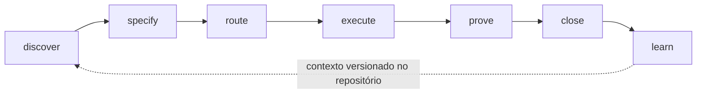

[English](README.md) | **Português (Brasil)**

> Tradução do [README.md](README.md) canônico (inglês). Em caso de
> divergência, a versão em inglês prevalece.

<div align="center">


# POSE — Project Operating Standard for Engineering

**Transforme a engenharia assistida por IA em um sistema de entrega
pertencente ao repositório e verificável por máquina.**

[](https://github.com/oseiaspereira88/pose/releases/latest)
[](https://github.com/oseiaspereira88/pose/actions/workflows/ci.yml)
[](LICENSE)

[](https://docs.harne8.com/POSE/)

</div>

**Spec-Driven Development para entrega de software agêntica governada.**

O POSE é um framework SDD open source que transforma especificações, política,
execução, evidência, follow-ups e conhecimento de engenharia em um sistema de
entrega versionado no repositório e verificável por máquina. Um único binário
Go nativo, Apache-2.0, local-first.



Agentes de código são cada vez mais capazes de implementar o trabalho. O POSE
governa as condições em volta dele:

- o que está pronto para começar;
- quais requisitos e regras são autoritativos;
- qual workflow e quais checks se aplicam;
- qual evidência prova a conclusão;
- como o trabalho residual precisa ser tratado;
- qual conhecimento de engenharia deve sobreviver à sessão.

O repositório continua sendo a fonte da verdade enquanto agentes, modelos, IDEs
e provedores de CI mudam.

O POSE não é mais um agente de código, IDE ou quadro de projetos. Ele é o
contrato de engenharia contra o qual humanos, agentes e CI executam.

## Por que o POSE

O Spec-Driven Development melhorou o caminho da intenção até a implementação:
requisitos deixaram de viver apenas no prompt.

O POSE estende essa ideia para o resto da entrega. O mesmo contrato que define
o trabalho também determina quando ele está pronto para começar, quais regras
se aplicam, quais checks precisam passar, qual evidência comprova a entrega,
como o trabalho residual é tratado e o que deve ser lembrado no próximo ciclo.

Uma spec não é bem-sucedida só porque código foi gerado. O POSE aplica gates de
readiness antes da execução e de closeout depois dela, com checks nativos do
repositório e evidência versionada.

**O agente pode dizer que terminou. O POSE exige que o repositório consiga
provar.**

## Agent-neutral, autoritativo no lifecycle

O POSE funciona com diferentes agentes de código por instruções de repositório,
skills portáteis, CLI e MCP. Ele não escolhe seu agente, modelo ou editor.

O POSE é, ele próprio, um framework SDD. Quando adotado, ele passa a ser a
autoridade do lifecycle de especificação e entrega daquele repositório — IDs de
requisito, status, dependências, readiness, definição de pronto, closeout e
conhecimento.

Rodar um segundo framework SDD base sobre o mesmo lifecycle cria autoridades
concorrentes exatamente sobre esses artefatos. Por isso o modelo atual de
interoperabilidade favorece **migração em vez de posse concorrente**: trabalho
existente de Spec Kit e OpenSpec pode ser importado para o POSE, revisado e
então governado sob o lifecycle do POSE.

Agent-neutral não é o mesmo que neutro quanto a framework SDD. O POSE é neutro
sobre quem executa; ele não é neutro sobre quem é dono do lifecycle.

## Quickstart

Caminho rápido para Linux e macOS (execute a partir do repositório Git que
deve receber o contrato do POSE):

```bash
curl -fsSLO https://github.com/oseiaspereira88/pose/releases/latest/download/install.sh && bash install.sh
```

Este caminho acompanha o release mais recente e instala o binário nativo em
`~/.local/bin`. Ele depende de HTTPS, mas não verifica independentemente o
checksum do arquivo nem a identidade Sigstore. Use o fluxo fixado abaixo
quando reprodutibilidade ou verificação de cadeia de suprimentos for
necessária.

<details>
<summary><strong>Instalação verificada: arquivo fixado por checksum (Linux, macOS, Windows)</strong></summary>

Baixe o arquivo do release para a sua plataforma, verifique o checksum,
coloque o `pose` no `PATH` e então instale o POSE em um repositório Git. Os
assets de release seguem o padrão `pose_<versão>_<os>_<arch>` — `tar.gz`
para Linux e macOS, `zip` para Windows — em
`linux`/`darwin`/`windows` × `amd64`/`arm64`.

Linux e macOS (bash ou zsh; substitua `linux_amd64` pela sua plataforma):

```bash
V=5.0.5
curl -fsSLO "https://github.com/oseiaspereira88/pose/releases/download/v${V}/pose_${V}_linux_amd64.tar.gz"
curl -fsSLO "https://github.com/oseiaspereira88/pose/releases/download/v${V}/checksums.txt"
sha256sum --check --ignore-missing checksums.txt   # macOS: shasum -a 256 -c
tar -xzf "pose_${V}_linux_amd64.tar.gz" pose
install -m 0755 pose ~/.local/bin/pose             # qualquer diretório no PATH
pose install /caminho/do/seu/repo
```

Windows (PowerShell):

```powershell
$V = "5.0.5"
Invoke-WebRequest "https://github.com/oseiaspereira88/pose/releases/download/v$V/pose_${V}_windows_amd64.zip" -OutFile "pose_${V}_windows_amd64.zip"
Invoke-WebRequest "https://github.com/oseiaspereira88/pose/releases/download/v$V/checksums.txt" -OutFile checksums.txt
(Get-FileHash "pose_${V}_windows_amd64.zip" -Algorithm SHA256).Hash -eq ((Get-Content checksums.txt | Select-String "pose_${V}_windows_amd64.zip") -split '\s+')[0]
Expand-Archive "pose_${V}_windows_amd64.zip" -DestinationPath .
# mova pose.exe para um diretório no PATH e então:
pose install C:\caminho\do\seu\repo
```

No caminho verificado, sempre confira o arquivo antes de executar o binário.
O `install.sh` do bundle de release também pode ser baixado junto com esse
binário verificado e executado localmente.

</details>

O instalador:

- embute workflows, regras, templates, skills e o locale selecionado;
- deriva nome e ID do projeto, com flags explícitas de override;
- configura o mesmo binário como servidor MCP;
- preserva specs, ADRs, conhecimento, relatórios e roadmaps existentes;
- termina com `init`, `index` e `check --strict` nativos;
- reporta sucesso apenas quando o gate estrutural passa.

Requisitos: Git e o binário nativo `pose`. Bash é necessário apenas ao usar
o `install.sh` opcional do bundle de release; o runtime em si não precisa de
Bash, Python, Node.js ou serviço hospedado. Os alvos de release suportados
são Linux, macOS e Windows em `amd64` e `arm64`.

Todo release publica `compatibility.json` (engine suportado, schema e pares
de upgrade) e o `compatibility-report.md` gerado (a evidência do gate de
release) como assets do release. SemVer do binário e compatibilidade do
schema do repositório são eixos independentes: `pose update` migra uma
instância para frente através de migrações idempotentes ordenadas; downgrade
não é suportado por contrato.

### Execute uma primeira entrega governada

```bash
pose init --wizard --yes
pose new-spec customer-export
pose suggest feature

# Preencha Intent, requisitos R1/R2... e Technical Plan.
pose lint-spec customer-export --ready-check

# Implemente e então execute as verificações declaradas do repositório.
pose validate --strict
pose report --task "customer-export" --spec customer-export

# Carimbe completed_at e dê disposição a cada follow-up antes do done.
pose lint-spec customer-export --strict
```

### Traga specs de outra ferramenta SDD

Já usa outro formato SDD?

```bash
pose import spec-kit .specify/specs --dry-run
pose import openspec openspec/changes/add-2fa --dry-run
```

O importador valida o lote completo antes de escrever, rejeita symlinks,
nunca sobrescreve uma spec existente e reporta tudo que ainda precisa de
curadoria humana.

Veja [`examples/brownfield-kits/`](examples/brownfield-kits/) para três
jornadas de adoção reais e executáveis — adoção direta, importação do Spec
Kit e importação do OpenSpec — cada uma com um guia progressivo de
visibilidade até gate bloqueante e uma história de rollback, exercitadas de
ponta a ponta pela suíte de testes.

## Por que o POSE

Ferramentas de IA aceleram a implementação, mas velocidade sozinha não
resolve os problemas sistêmicos que elas amplificam:

- requisitos ficam presos no histórico do chat;
- agentes recebem instruções inconsistentes;
- “done” é declarado sem evidência reproduzível;
- follow-ups desaparecem em prosa;
- as mesmas falhas são corrigidas repetidamente;
- contexto se perde quando o agente ou a sessão muda.

O POSE torna cada uma dessas preocupações um mecanismo explícito e
versionado.

| Diferencial                                   | O que o POSE faz                                                        | Mecanismo verificável                          |
|-----------------------------------------------|-------------------------------------------------------------------------|------------------------------------------------|
| **Governa a entrega, não apenas a geração**   | Conecta planejamento, execução, aceite e aprendizado                    | Specs + workflows + regras + evidência + histórico |
| **Gates de entrada e de saída**               | Recusa execução sem readiness e recusa done sem closeout                | `pose lint-spec --ready-check` / `--strict`    |
| **Usa verificações reais de engenharia**      | Executa os comandos nativos de test, lint, typecheck e build do repo    | `validation-matrix.json` + `pose validate`     |
| **Transforma evidência em memória**           | Armazena relatórios versionáveis e histórico append-only                | `.pose/reports/` + `pose report`               |
| **Fecha o trabalho residual**                 | Exige uma disposição para cada follow-up                                | `pose followups` + vocabulário de closeout     |
| **Escala falhas sistêmicas**                  | Detecta falhas recorrentes de tarefa e roteia a correção estrutural     | `pose recurrence-check` + workflow de escalonamento |
| **Preserva o contexto operacional**           | Dá dono, sensibilidade e TTL a handoffs e decisões                      | `.pose/knowledge/` + `knowledge-check`         |
| **Planeja a partir de dependências**          | Valida DAGs de specs e milestones e calcula readiness                   | `depends_on`, roadmaps, `pose_spec_readiness`  |
| **Revisa um sujeito imutável**                | Separa o bundle selado de sua atestação e auto-descarta critérios validados pelo CI | `pose review bundle` / `auto-attest` / `verify` |
| **Funciona entre agentes**                    | Expõe instruções curtas, skills portáveis e ferramentas MCP             | `AGENTS.md`, Agent Skills, `pose serve-mcp`    |
| **Mantém o controle local**                   | Roda offline e mantém a fonte de verdade no Git                         | Um binário sem CGO; nenhuma dependência hospedada |

## O que vem na caixa

| Caminho ou componente | Propósito                                                                                        |
|-----------------------|--------------------------------------------------------------------------------------------------|
| binário `pose`        | CLI nativa, instalador, gates, relatórios, métricas, housekeeping e MCP                          |
| `.pose/specs/`        | Contratos vivos de feature com ciclo de vida e dependências                                      |
| `.pose/workflows/`    | Procedimentos para feature, bugfix, review, refactor, docs, recorrência, release e UI surfaces   |
| `.pose/rules/`        | Regras cumulativas de segurança, backend, frontend, Kubernetes, evidência e conhecimento         |
| `.agents/skills/`     | Onze Agent Skills portáveis; links compatíveis com Claude são instalados                         |
| `.pose/roadmaps/`     | Roadmaps governados com DAGs de milestones e readiness                                           |
| `.pose/knowledge/`    | Handoffs, notas e decision logs governados por TTL                                               |
| `.pose/reports/`      | Evidência versionável e histórico JSONL append-only                                              |
| `.pose/indexes/`      | Projeções de repositório, módulo, tarefa, spec-graph e roadmap                                   |
| `pose serve-mcp`      | 47 ferramentas de governança POSE e 3 reporters opcionais do Conductor via stdio ou Streamable HTTP |
| `mcp-enforce/`        | Identidade opcional por projeto/execução, decisões OPA e auditoria                               |
| `pose-action/`        | Adaptador de GitHub Action para gates determinísticos                                            |

Leia a [arquitetura técnica](docs-site/docs/architecture.md) para cada
componente e mecanismo. Leia a
[avaliação de capacidade](docs-site/docs/capability-assessment.md) para a
maturidade atual e lacunas frente ao estado da arte. Os
[roadmaps de produto](docs-site/docs/product-roadmaps.md) governados
convertem essas descobertas em roadmaps, specs de implementação e gates de
release conscientes de dependências — 10 roadmaps e 115 specs hoje,
acompanhados em `.pose/roadmaps/` e `.pose/specs/`.

## Release mais recente

Consulte a página de [Releases](https://github.com/oseiaspereira88/pose/releases)
para as notas atuais e os artefatos verificados. As notas por ciclo ficam em
[`.pose/changelogs/`](.pose/changelogs/).

## Onde o POSE é mais forte

A vantagem central do POSE é a **governança de ciclo fechado**. Autorar
specs é apenas o primeiro passo. O sistema também verifica se uma spec está
pronta, roteia o workflow correto, executa gates de qualidade
determinísticos, registra a evidência de aceite, força o trabalho residual
a ser triado e detecta quando correções locais devem virar melhorias
sistêmicas.

Essa combinação é especialmente valiosa para:

- equipes que usam mais de um agente de código ou provedor de modelo;
- repositórios brownfield onde arquitetura e verificações já existem;
- entrega regulada ou de alta responsabilização;
- monorepos com stacks e criticidades de módulo diferentes;
- times de plataforma padronizando engenharia sem impor uma IDE;
- organizações se preparando para orquestração governada de agentes.

Se você precisa apenas de um template de prompt ou de uma pasta leve de
planejamento, o POSE pode ser mais estrutura do que você precisa. Comece com
Spec Kit ou OpenSpec e importe o resultado depois; o POSE inclui importadores
nativos e seguros para ambos.

## Como o POSE se compara

As ferramentas abaixo são adjacentes, não intercambiáveis. Os frameworks SDD
das duas primeiras linhas são a exceção: o POSE importa deles em vez de rodar
ao lado deles. A
pergunta útil não é “qual ferramenta vence?”, mas “qual parte da entrega cada
ferramenta torna autoritativa?”

| Solução                                                                                    | Força principal                                                                         | Distinção do POSE                                                                                                                   |
|--------------------------------------------------------------------------------------------|-----------------------------------------------------------------------------------------|-------------------------------------------------------------------------------------------------------------------------------------|
| [GitHub Spec Kit](https://github.com/github/spec-kit/blob/main/docs/reference/overview.md) | Ciclo de vida SDD rico com integrações de agentes, extensões, presets, workflows e bundles | O POSE enfatiza a governança pós-planejamento em todo o repositório: gates de entrada/saída, evidência de validação, recorrência e conhecimento com expiração |
| [OpenSpec](https://github.com/Fission-AI/OpenSpec)                                         | Propostas de mudança brownfield leves e neutras a agente, deltas e fluxo archive-to-source | O POSE adiciona gates de entrega determinísticos, validação consciente de módulo, follow-ups governados, histórico operacional e readiness de portfólio |
| [Kiro](https://aws.amazon.com/documentation-overview/kiro/)                                | Serviço agêntico integrado com specs, steering e event hooks                            | O POSE é neutro a editor/modelo, offline e pertencente ao repositório                                                               |
| [Backstage](https://backstage.io/docs/features/software-catalog/)                          | Catálogo organizacional de software, templates e portal de desenvolvimento              | O POSE governa a execução dentro de cada repositório e pode alimentar um portal/control plane                                       |
| Orquestradores de CI                                                                       | Executam pipelines e exibem resultados de jobs                                          | O POSE decide a trilha aplicável, normaliza severidade e preserva evidência como dado de produto governado                          |
| Issue trackers                                                                             | Coordenam pessoas, status e trabalho de portfólio                                       | O POSE torna o contrato de engenharia e os critérios de aceite executáveis ao lado do código                                        |

O POSE não substitui as forças especializadas acima. Ele fornece a espinha
de governança que permanece estável enquanto agentes, editores, provedores
de CI e portais mudam.

## POSE e Harne8

O POSE é Apache-2.0, local-first e completo dentro do seu domínio: ele não
precisa de conta Harne8 nem de serviço hospedado para cumprir sua função. O
Harne8 usa o POSE como engine de governança e resolve outro problema — o que
aparece quando a unidade deixa de ser um repositório.

| Comece com o POSE                     | Escale com o Harne8                                   |
|---------------------------------------|-------------------------------------------------------|
| Specs e roadmaps locais ao repositório | Portfólio visual multi-projeto                        |
| Workflows, regras e skills portáveis  | Orquestração durável de tarefas através do Conductor  |
| Validação determinística e evidência  | Execução governada de agentes através do Harness      |
| Insights e recorrência locais         | Visões centrais de confiabilidade, custo e política   |
| API de governança MCP nativa          | Enriquecimento de contexto através do GraphForge      |
| Aplicação opcional de política OPA    | Identidade central, aprovações, auditoria e operações |

A fronteira é intencional, e não é paywall: nada é retirado do POSE para criar
demanda pelo Harne8. Eles governam escopos diferentes. O Harne8 passa a ser
relevante quando a governança local ao repositório deixa de bastar — muitos
repositórios, muitas pessoas, política compartilhada, aprovações centrais.

## Adote progressivamente

1. **Observe:** instale o POSE e execute verificações em modo tolerante.
2. **Alinhe:** personalize metadados de módulo, regras e a matriz de validação.
3. **Aplique:** torne verificações requeridas estáveis bloqueantes no CI.
4. **Aprenda:** gere relatórios, trie follow-ups e habilite verificações de recorrência.
5. **Escale:** conecte clientes MCP ou o Harne8 sem mover a fonte de verdade
   para fora do repositório.

Equipes que usam pre-commit.com podem habilitar `pose-check`, `pose-lint-spec`
e `pose-history-check`. Veja o [guia de CI](docs-site/docs/ci.md), a
[referência da CLI](docs-site/docs/cli.md) e o
[docs site](https://docs.harne8.com/POSE/) para o restante.

## Segurança e privacidade

- Gates são offline por contrato.
- Telemetria é desabilitada por padrão e não há endpoint de coleta embutido.
- Caminhos de importação e de módulo são confinados à raiz do projeto.
- Validação usa arrays estruturados de programa/argumentos; comandos shell
  legados são rejeitados.
- Conhecimento restrito é excluído das leituras MCP.
- Política MCP baseada em OPA falha fechada em erros de avaliação.
- Trabalho que modifica o repositório permanece responsabilidade do sandbox
  de execução, e não uma superfície geral de escrita MCP.

Veja [SECURITY.md](SECURITY.md) para reportar vulnerabilidades.

## Fronteira atual do produto

O POSE fornece hoje um forte engine de governança local, não um serviço
hospedado multi-equipe. Seus relatórios locais são artefatos Git auditáveis,
não atestações assinadas de cadeia de suprimentos. Roadmaps expressam
dependência/readiness, não capacidade de equipe. Insights locais resumem
resultados do POSE, não desempenho de deployment ou incidentes.

Esses limites são explícitos na
[avaliação de capacidade](docs-site/docs/capability-assessment.md), junto com
o trabalho necessário para alcançar o próximo nível de maturidade.

## Licença

Apache-2.0 — veja [LICENSE](LICENSE) e [NOTICE](NOTICE).

Contribuições são bem-vindas: veja [CONTRIBUTING.md](CONTRIBUTING.md).

O POSE é open source sob Apache-2.0 e é desenvolvido abertamente como projeto
independente. Ele também move o modelo de governança usado pelo **Harne8**.
