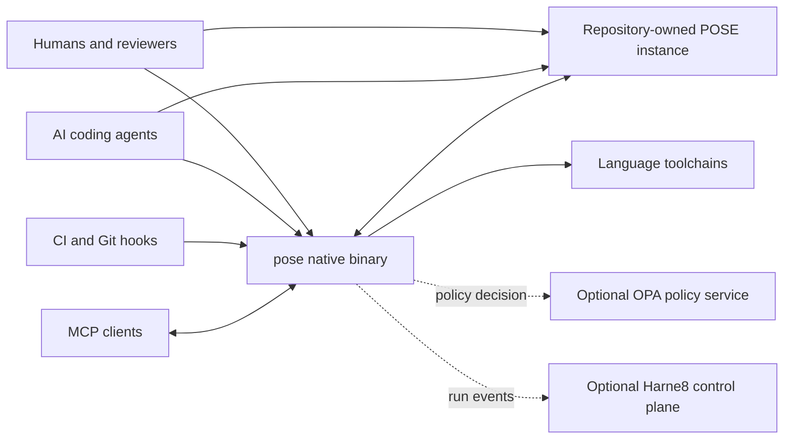
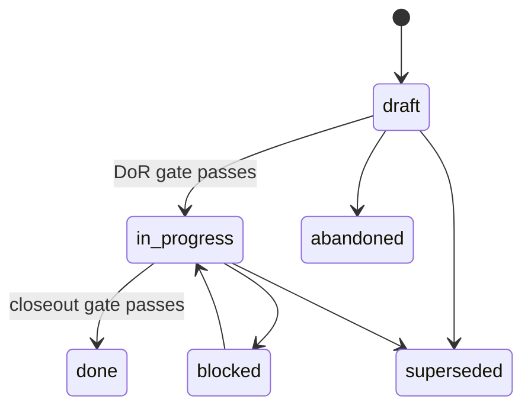
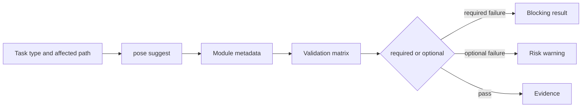
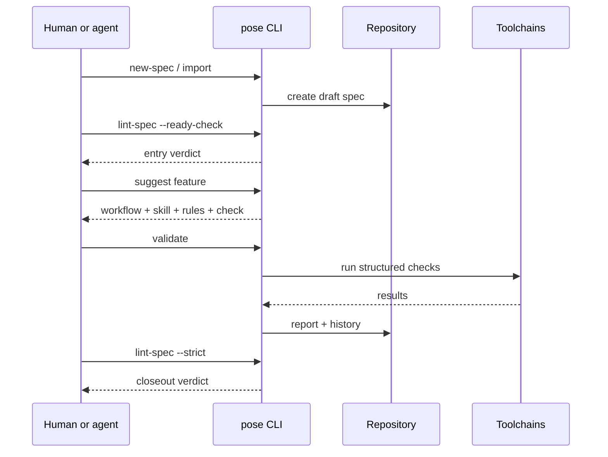
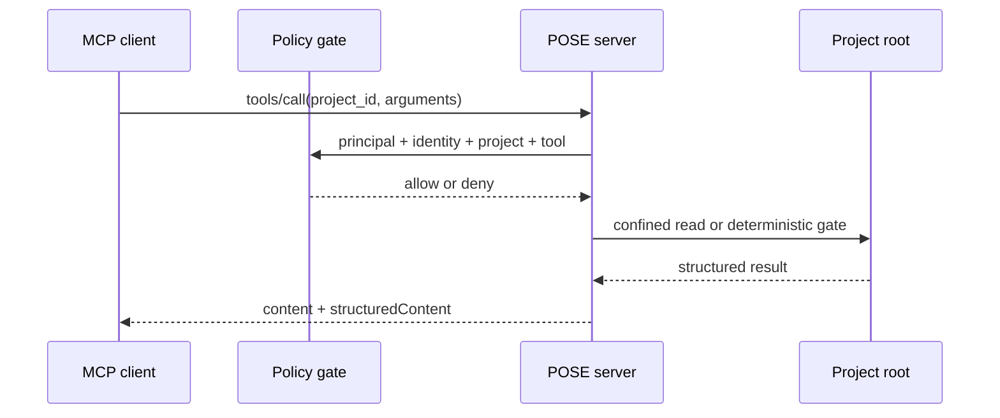

# Technical architecture

**Doc type:** Explanation &nbsp;·&nbsp; **Applies to:** POSE ≥ 0.9.0

**Scope:** POSE open-source distribution  
**Verified:** 2026-07-18 at repository commit `d9c0b98`

POSE is a repository-local governance system for human and AI-assisted software
delivery. It combines a versioned operating contract, a native deterministic
engine and an MCP adapter. It does not implement an IDE, an agent runtime or a
hosted control plane; it governs how those systems may work inside a repository.

## System context



The repository remains the source of truth. POSE artifacts move through normal
Git review, and the engine can operate without a network connection. External
systems consume explicit contracts instead of owning the governance state.

## Architectural principles

1. **Keep governance with the code.** Store specs, rules, workflows, evidence
   and operational knowledge in version control.
2. **Separate deterministic decisions from semantic judgment.** Let the CLI
   enforce syntax, lifecycle and repeatable gates; require humans or agents to
   decide intent, trade-offs and consequential follow-up disposition.
3. **Close both sides of delivery.** Gate entry with Definition of Ready and
   gate exit with evidence, completion metadata and follow-up triage.
4. **Prefer adapters over duplicated engines.** Reuse the same Go domain from
   the CLI and MCP server.
5. **Fail closed at trust boundaries.** Confine paths, reject legacy shell
   commands, deny policy failures and keep sensitive knowledge out of MCP.
6. **Adopt incrementally.** Start with visibility, promote stable checks to
   blocking gates and preserve existing repository content during upgrades.

## Distribution and runtime

POSE ships as one CGO-free Go binary named `pose`. Release builds target Linux,
macOS and Windows on `amd64` and `arm64`. The binary contains:

- the CLI dispatcher and native command implementations;
- the embedded install scaffold for English and Brazilian Portuguese;
- the POSE domain readers used by MCP;
- the stdio and Streamable HTTP MCP transports;
- the optional in-process policy and audit adapter.

The installed instance is data, not another runtime. `pose install` copies the
contract and templates into the target repository, then runs `init`, `index`
and `check --strict`. Reinstallation updates managed machinery while preserving
specs, ADRs, roadmaps, knowledge and reports. `.pose/schema-version` allows the
engine to apply ordered, idempotent migrations with `pose upgrade`.

## Component model

| Component | Responsibility | Primary implementation |
|---|---|---|
| Native CLI | Scaffold, validate, inspect, report, migrate and maintain | `pose-mcp/internal/cli/` |
| Governance domain | Read specs, roadmaps, knowledge, reports and insights | `pose-mcp/internal/pose/` |
| MCP server | Expose project-scoped governance tools | `pose-mcp/internal/mcpserver/` |
| Bootstrap | Resolve roots and wire transports, auth and policy | `pose-mcp/internal/bootstrap/` |
| Installer scaffold | Embed the repository contract and locales | `pose-mcp/internal/scaffold/` |
| Policy enforcement | Evaluate OPA decisions, identity and audit | `mcp-enforce/` |
| CI adapters | Run gates in GitHub Actions, pre-commit and Git hooks | `pose-action/`, `.pre-commit-hooks.yaml` |
| Documentation | Explain operation and public contracts | `docs-site/`, `AGENTS.md`, `POSE.md` |

## Installed contract

```text
AGENTS.md                 short instruction and precedence contract
POSE.md                   operating manual
.agents/skills/           portable Agent Skills
.claude/skills/           Claude-compatible skill links
.pose/
  workflows/              task procedures
  rules/                  cumulative domain constraints
  templates/              governed artifact templates
  specs/                  living feature contracts
  roadmaps/               milestone dependency graphs
  adr/                    implementation decisions
  knowledge/              handoffs, notes and decision logs
  changelogs/             unreleased fragments and release notes
  indexes/                machine-readable projections and configuration
  reports/                evidence, history and retention archive
  policy/                 local policy data
  schema-version          instance/engine compatibility contract
```

Authoritative documents and generated projections are deliberately separated.
Specs and roadmaps are authoritative; `spec-graph.json` and `roadmaps.json` are
rebuildable indexes.

## Mechanism 1: task routing

`task-map.json` maps a task type to its workflow, skill, cumulative rules,
artifact obligations and validation command. `pose suggest` resolves that map
and can add domain rules from an explicit domain or repository path.

This mechanism turns broad instructions such as “implement a feature” into a
stable execution trail without embedding the trail in a prompt. It is also the
boundary between generic POSE behavior and repository-specific policy.

## Mechanism 2: spec lifecycle

Each spec carries flat, machine-readable frontmatter and seven narrative
sections. The lifecycle is intentionally asymmetric:



- `lint-spec --ready-check` requires intent, requirements with stable `R<N>`
  identifiers and a technical plan before execution.
- `lint-spec --strict` requires `completed_at` and a disposition for every
  follow-up before `done`.
- `check` validates status transitions and references at repository scope.

The spec remains a living contract: planning, decisions, validation strategy
and final report stay together rather than becoming disconnected tickets.

## Mechanism 3: dependencies, readiness and roadmaps

`depends_on` accepts spec, milestone and roadmap references. `priority` orders
eligible work without creating false dependencies. `pose check` verifies
existence and acyclicity, while `pose index` builds the cached graph.

Roadmaps add milestone DAGs, target dates and exclusive membership of specs in
active roadmaps. `pose_spec_readiness` resolves the graph for agents and control
planes. This provides planning eligibility, not transactional task scheduling;
fine-grained execution state belongs in an external control plane.

## Mechanism 4: workflows, rules and skills

- **Workflows** define ordered procedures for feature, bugfix, review,
  refactor, documentation and recurrence escalation.
- **Rules** accumulate constraints by domain. Security wins when rules conflict.
- **Skills** package recurring agent behavior using the portable `SKILL.md`
  structure defined by the [Agent Skills specification](https://agentskills.io/specification).
- **AGENTS.md** keeps precedence and mandatory obligations short enough for
  routine agent loading.

The layers are independent so a team can change a security rule without
forking every workflow or repeating the same instruction in every prompt.

## Mechanism 5: repository discovery and indexes

`pose index` scans repository markers and materializes deterministic JSON:

- `repo-map.json`: repository structure and detected modules;
- `services.json` and `packages.json`: deployable and package views;
- `spec-graph.json`: dependency projection;
- `roadmaps.json`: roadmap projection;
- `task-map.json`: routing configuration;
- `module-metadata.json`: ownership, criticality, domain and validation profile.

`pose init --wizard` uses stack markers to seed validation configuration.
Indexes are intentionally shallow and local; semantic code intelligence is a
separate concern that Harne8 can supply through GraphForge.

## Mechanism 6: deterministic validation

`validation-matrix.json` defines checks as structured `program`, `args`, `env`
and optional file predicates. Legacy shell command strings are rejected.
Checks are selected by stack and refined through module overrides.



Supported baseline stacks are Node.js, Go, Rust and Java. The matrix delegates
to native project tools such as `npm`, `go`, `cargo`, Maven and Gradle; POSE
governs selection and evidence rather than replacing those ecosystems.

## Mechanism 7: evidence, history and insights

`pose report` persists a Markdown report and an append-only JSONL record. Each
record includes task identity, workflow, validation profile, outcome, sequence
and a stable-field hash. `history-check` prevents untracked history from being
silently discarded.

`pose stats` aggregates outcomes by workflow, task or context. MCP exposes the
same domain through `pose_insights`. Reports can be archived by retention
policy, but historical JSONL is preserved as the recurrence source.

POSE evidence is repository-auditable, not a cryptographic build attestation.
Signed provenance and SBOMs remain release-pipeline responsibilities.

## Mechanism 8: follow-ups and recurrence

Closeout dispositions form a controlled vocabulary: open, spawned, covered,
duplicate, done or wont-do. `pose followups` aggregates the live backlog and
suggests lexical near-duplicates. Semantic equivalence remains a reviewed
decision.

`recurrence-check` scans historical failures by task slug and time window. The
recurrence workflow converts repeated local fixes into a rule, workflow, spec
or explicit exception. This is the feedback edge that closes the governance
loop.

## Mechanism 9: operational knowledge

Knowledge artifacts have type, owner, sensitivity, creation/review dates and a
bounded TTL. `knowledge-check` validates schema and overdue limits;
housekeeping lists, archives and purges expired entries through explicit apply
operations. Restricted entries are not returned by MCP.

Knowledge is not a vector database. Its purpose is small, reviewable operational
memory that survives agent and session boundaries without becoming permanent,
ownerless documentation.

## Mechanism 10: change and release traceability

One changelog fragment is associated with each delivered spec. The release
pipeline consolidates fragments into user-facing notes and builds six native
platform targets through GoReleaser. GitHub Actions, pre-commit and native Git
hooks provide progressively stronger adoption paths.

The release artifacts currently include archives, SHA-256 checksums, the
installer and license material. Cryptographic signatures, SBOMs and SLSA
provenance are tracked as maturity gaps rather than implied guarantees.

## Mechanism 11: MCP governance API

`pose serve-mcp` supports stdio and Streamable HTTP. The server currently
advertises 18 POSE tools for specs, readiness, roadmaps, changelogs, follow-ups,
structural gates, task routing, workflows, rules, skills, knowledge, reports
and insights. Three optional `conductor_run_*` tools report external runs when
Harne8 endpoints are configured.

MCP tools use JSON schemas and project-scoped root resolution. The server
supports a default project plus explicit or directory-discovered roots. The
[MCP tools contract](https://modelcontextprotocol.io/specification/2025-06-18/server/tools)
provides discovery and invocation; POSE keeps file mutations in the execution
sandbox instead of exposing general-purpose write tools.

## Mechanism 12: policy, identity and audit

HTTP mode can use bearer authentication. `mcp-enforce` adds:

- principal and project extraction;
- HMAC-bound execution identities with scopes, run ID and expiry;
- OPA-backed per-call decisions;
- default denial on policy transport, decode or undefined-path failures;
- structured allow and deny audit events without payload content.

[OPA](https://www.openpolicyagent.org/docs) remains the policy decision engine;
POSE supplies scoped input and enforcement. Stdio mode inherits the security
boundary of the spawning client. Production TLS, secret distribution and
multi-replica coordination belong to the deployment environment.

## Mechanism 13: interoperability and adoption

POSE imports Spec Kit and OpenSpec artifacts with a dry-run, bounded file and
byte budgets, symlink rejection, batch preflight and a curation report. Import
is intentionally one-way: POSE becomes the lifecycle authority after review.

Agents can consume the contract through repository files, Agent Skills or MCP.
CI systems can call stable CLI commands. This keeps the core independent from
one editor, model provider or hosted service.

## Mechanism 14: localization, diagnostics and telemetry

The embedded distribution supports English and Brazilian Portuguese. Unknown
locales fall back to English. `pose doctor --json` checks the binary,
dependencies, instance, schema, skill links, MCP configuration and Git hooks.

Telemetry is disabled by default. Enabling it still sends nothing until an
endpoint is explicitly configured. The payload is limited to anonymous ID,
binary version and command name; repository names, paths and content are
excluded by contract.

## Primary data flows

### Feature delivery



### MCP read path



## Extension boundaries

Extend POSE safely through repository data before changing the engine:

- add task types to `task-map.json`;
- add cumulative rules and workflows;
- add Agent Skills;
- add structured matrix checks and module overrides;
- consume reports and indexes from external systems;
- add narrow MCP tools with explicit schemas and risk classification.

Engine changes are appropriate when a deterministic invariant must be shared
by every installation. Hosted orchestration, semantic code graphs, durable task
state and visual portfolio management belong to Harne8 rather than the free
repository engine.

## Known architectural limits

- POSE does not execute or schedule AI agents by itself.
- Roadmaps model eligibility and ordering, not capacity or transactional work.
- Local insights do not yet implement DORA delivery metrics.
- Reports are auditable Git artifacts but are not signed attestations.
- MCP is deliberately tool-only: list tools paginate with opaque cursors and
  the catalog is stable within a process lifetime, but resources and prompts
  are not implemented — a generic resources primitive would expose
  repository files wholesale, and prompts risk becoming policy outside
  `.pose/workflows/`, both explicitly out of scope (see [MCP server](mcp.md)).
- The baseline validation matrix covers four stack families and relies on
  repository overrides for other ecosystems.

Use the [capability assessment](capability-assessment.md) for scored maturity,
evidence and prioritized gaps.
